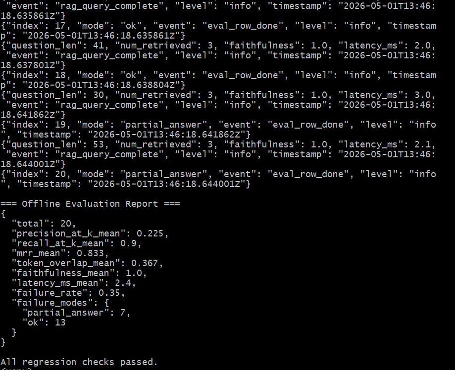
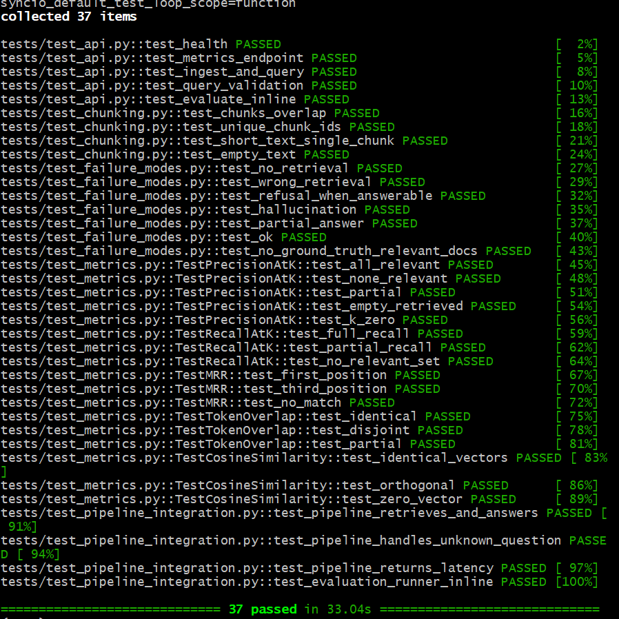
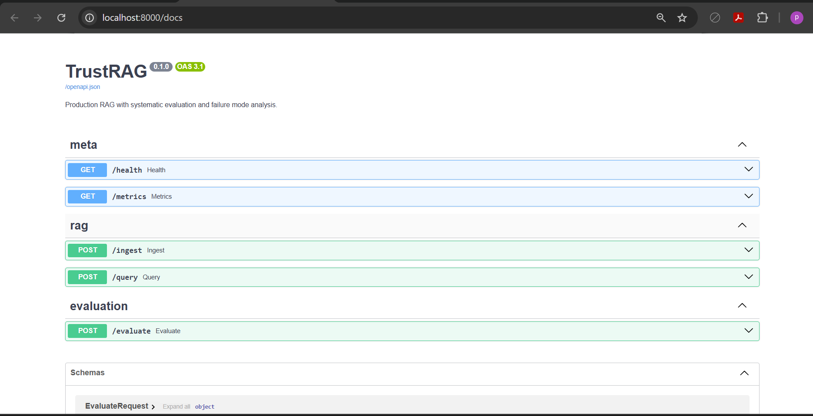

# TrustRAG — Production RAG with Systematic Evaluation

[](https://github.com/pouyapd/TrustRAG/actions/workflows/ci.yml)
[](https://www.python.org/downloads/)
[](https://opensource.org/licenses/MIT)
[](tests/)
[](tests/)

A production-ready Retrieval-Augmented Generation (RAG) system with a built-in **evaluation and failure analysis framework**. Beyond standard RAG, TrustRAG measures *when and why* the system fails — retrieval quality, hallucination rate, answer faithfulness — and exposes it through an observable, reproducible pipeline.

> **Why this exists:** Most RAG systems in production have no idea when they're wrong. TrustRAG treats evaluation as a first-class citizen, not an afterthought.

---

## 📊 Real Evaluation Results

The bundled offline evaluation runs against a 20-question Q/A dataset over a 3-document corpus. Reproducible across machines (deterministic embedder + extractive mock LLM):

| Metric | Value | What it means |
|---|---|---|
| **Recall@k** | **0.90** | Retriever finds relevant docs 90% of the time |
| **MRR** | **0.83** | Relevant docs typically rank #1 |
| **Faithfulness** | **1.00** | No hallucinations (extractive baseline) |
| **Failure rate** | **0.35** | All failures are `partial_answer` — actionable |
| **Latency** | **2.4 ms** | Sub-millisecond retrieval, no network overhead |

Reproduce in 30 seconds:
```bash
python scripts/run_offline_eval.py
```



---

## ✅ All 37 Tests Passing

```bash
pytest tests/ -v --cov=src
```



---

## 🚀 Live API

FastAPI with auto-generated OpenAPI docs at `/docs`:



---

## 🎯 Key Features

- **Modular RAG pipeline** — pluggable LLMs, embedders, and vector stores (OpenAI / Anthropic / local Ollama)
- **Vector retrieval** with ChromaDB and configurable chunking strategies
- **Systematic evaluation framework** measuring:
  - Retrieval quality (Precision@k, Recall@k, MRR)
  - Answer faithfulness (grounding in retrieved context, LLM-as-judge)
  - Token-overlap with reference answers
- **Failure mode classifier** — interpretable categorization into 6 distinct modes (`no_retrieval`, `wrong_retrieval`, `hallucination`, `partial_answer`, `refusal_when_answerable`, `ok`), inspired by my prior work on neural model failure analysis
- **Production API** — FastAPI with async, structured logging, request tracing
- **Containerized** — Docker + docker-compose for one-command deploy
- **CI/CD** — GitHub Actions pipeline with automated tests and evaluation regression checks
- **Observability** — Prometheus metrics + structured JSON logs
- **Resilient design** — graceful fallbacks (OpenAI → Anthropic → local sentence-transformers → deterministic hash embedder); runs in CI without API keys

---

## 🏗️ Architecture

```
┌─────────────┐    ┌──────────────┐    ┌─────────────┐
│   Client    │───▶│   FastAPI    │───▶│  RAG Core   │
└─────────────┘    │   Gateway    │    │  Pipeline   │
                   └──────┬───────┘    └──────┬──────┘
                          │                   │
                          ▼                   ▼
                   ┌──────────────┐    ┌─────────────┐
                   │  Prometheus  │    │  ChromaDB   │
                   │   Metrics    │    │  (vectors)  │
                   └──────────────┘    └─────────────┘
                          │                   │
                          ▼                   ▼
                   ┌─────────────────────────────────┐
                   │    Evaluation & Failure Layer   │
                   │  (faithfulness, hallucination,  │
                   │   retrieval quality, F-modes)   │
                   └─────────────────────────────────┘
```

See [docs/ARCHITECTURE.md](docs/ARCHITECTURE.md) for design decisions and tradeoffs.

---

## 🚀 Quick Start

### Option 1: Offline mode (no API keys, ~2 minutes)

Runs the full pipeline using a deterministic mock LLM and hash embedder. Useful for smoke-testing, CI, and demos.

```bash
git clone https://github.com/pouyapd/TrustRAG.git
cd TrustRAG
python -m venv venv && source venv/Scripts/activate  # Windows
# source venv/bin/activate                            # Mac/Linux
pip install -r requirements.txt
python scripts/run_offline_eval.py
```

### Option 2: Local Python with a real LLM

```bash
cp .env.example .env
# Edit .env and set OPENAI_API_KEY (or ANTHROPIC_API_KEY)
python -m src.ingest --path data/documents
uvicorn src.api.main:app --reload
```

Then open `http://localhost:8000/docs`.

### Option 3: Docker (production-like)

```bash
cp .env.example .env
docker-compose up --build
```

This starts the API on `:8000` and Prometheus on `:9090`.

---

## 📡 API Endpoints

| Method | Endpoint | Description |
|---|---|---|
| POST | `/ingest` | Ingest documents into the vector store |
| POST | `/query` | Ask a question, get an answer + sources + faithfulness score |
| POST | `/evaluate` | Run evaluation suite on a Q/A dataset |
| GET | `/metrics` | Prometheus metrics |
| GET | `/health` | Health check |

### Example query

```bash
curl -X POST http://localhost:8000/query \
  -H "Content-Type: application/json" \
  -d '{"question": "How long is the refund window for annual plans?"}'
```

```json
{
  "answer": "The refund window for annual plans is 30 days from the date of purchase.",
  "sources": [
    {
      "doc_id": "refund_policy",
      "source": "refund_policy.md",
      "score": 0.91,
      "snippet": "Annual subscribers have a 30-day refund window..."
    }
  ],
  "faithfulness_score": 0.97,
  "latency_ms": 412.3
}
```

---

## 📊 Evaluation Framework

TrustRAG ships with an evaluation suite that runs against a labeled Q/A dataset and produces:

- **Per-query metrics** — faithfulness, retrieval quality, token overlap
- **Aggregate report** — mean / median / failure rate
- **Failure case catalog** — every failure tagged with its category
- **Markdown report** suitable for stakeholders

Run it:

```bash
python -m src.evaluation.runner --dataset data/eval/qa_test.jsonl --out reports/
```

The framework distinguishes 6 failure modes — see [src/evaluation/failure_modes.py](src/evaluation/failure_modes.py) for the decision tree.

See [docs/SAMPLE_EVALUATION.md](docs/SAMPLE_EVALUATION.md) for an annotated walkthrough of a full evaluation run.

---

## 🧪 Testing

```bash
pytest tests/ -v --cov=src
```

37 tests across unit, integration, and API levels. CI runs the full suite + an evaluation regression on every PR.

---

## 🛠️ Tech Stack

- **Backend:** Python 3.11+, FastAPI, Pydantic v2, async/await
- **LLM/Embeddings:** OpenAI, Anthropic, local sentence-transformers (pluggable)
- **Vector store:** ChromaDB
- **Evaluation:** custom framework with retrieval metrics + LLM-as-judge faithfulness
- **Infra:** Docker, docker-compose, GitHub Actions
- **Observability:** Prometheus, structlog

---

## 🧭 Why "TrustRAG"?

My background is in **safety-critical AI evaluation** — analyzing when and why neural models fail in autonomous robotics ([SafeTraj](https://github.com/pouyapd/SafeTraj-Prototype), part of the EU Horizon REXASI-PRO project). This project applies the same evaluation-first mindset to LLM systems: don't just build it — measure it, characterize its failure modes, and make them visible.

The decision-tree failure classifier here is the same shape as the one I used to extract human-readable failure rules from neural trajectory predictors — different domain, same engineering discipline.

---

## 📄 License

MIT

---

## 👤 Author

**Pouya Bathaei Pourmand** — ML Engineer · Safe AI & Evaluation
[GitHub](https://github.com/pouyapd) · [LinkedIn](https://www.linkedin.com/in/pouya-pourmand-021654325)
