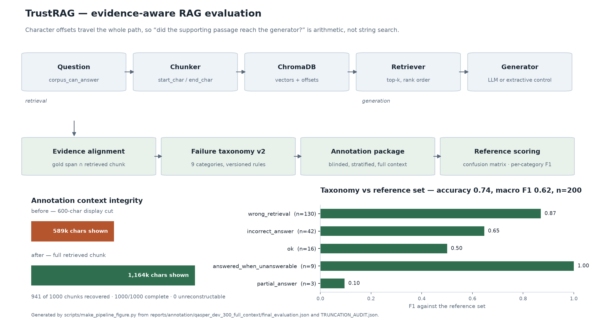
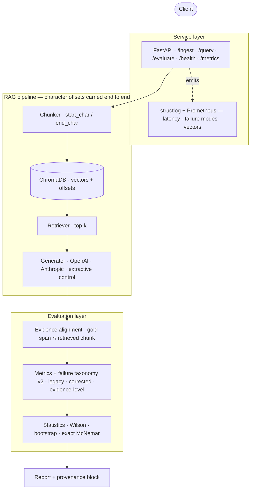
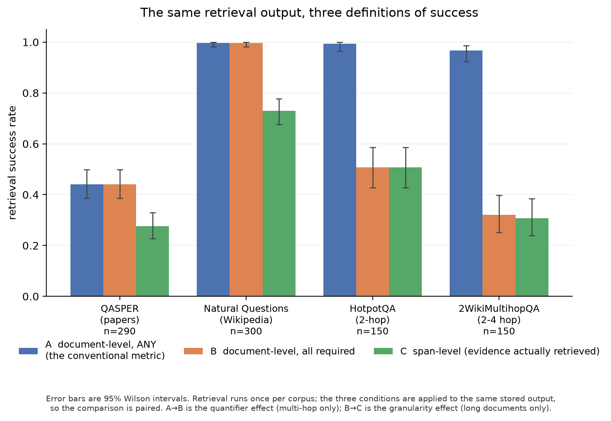
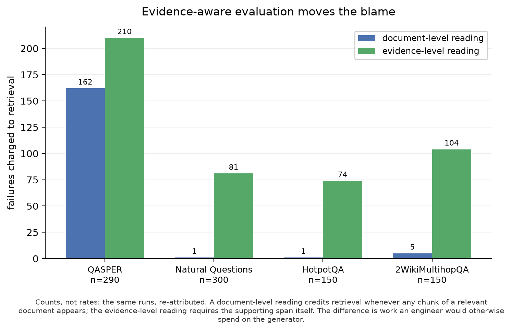
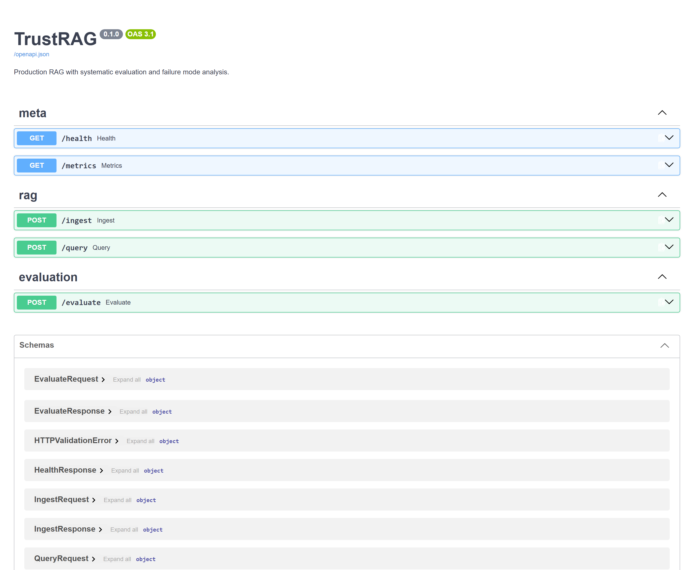
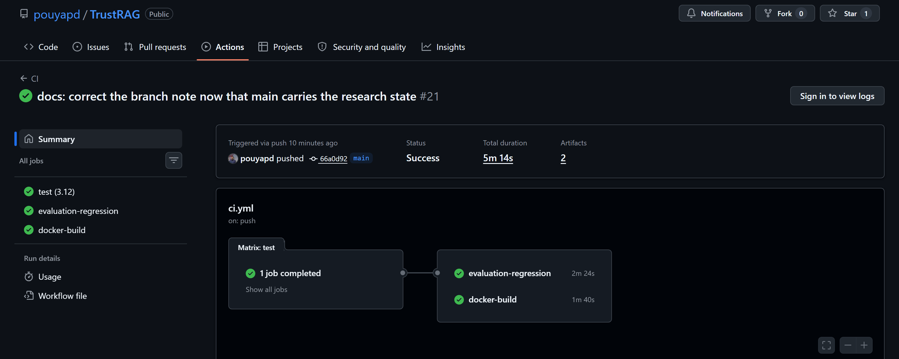

# TrustRAG — Evidence-Aware Evaluation and Failure Attribution for RAG

[](https://github.com/pouyapd/TrustRAG/actions/workflows/ci.yml)


**A research codebase for measuring *why* a retrieval-augmented generation
pipeline failed — retrieval, evidence, generation or abstention — instead of
reporting one aggregate score.** It asks a question most RAG evaluations do not:
not *"did we retrieve the right document?"* but *"did the passage that actually
supports the answer reach the generator?"*

Those two come apart systematically on long documents, and the difference decides
which pipeline stage a failure is charged to. On Natural Questions, the same
stored retrieval output yields **1** retrieval failure out of 300 under a
document-level reading and **81** under an evidence-level one.



*Rendered from the repository's own result files by
`scripts/make_pipeline_figure.py`; every number in the lower panels is read at
render time, none is hard-coded.*

---

## Contents

[Problem](#the-problem) · [Contributions](#contributions) ·
[Pipeline](#pipeline) · [Results](#results) · [Taxonomy](#failure-taxonomy) ·
[Reproducibility](#reproducibility) · [Research documentation](#research-documentation) ·
[Install and use](#install-and-use) · [Tests](#tests) · [Limitations](#limitations)

---

## The problem

Document-level recall answers *"did a chunk from the right document appear?"* On
a 37,000-character Wikipedia page, a chunk from anywhere in it passes — including
chunks containing none of the evidence. The retrieval metric reads green while
the generator works from context that cannot support the answer.

| | Document-level reading | Evidence-level reading |
|---|---|---|
| Failures charged to retrieval (NQ, n=300) | 1 | **81** |
| Engineering conclusion | "improve the model" | "fix chunking / top-k / ranking" |

Same stored run, two definitions of success, opposite conclusions. TrustRAG
reports both side by side and never lets one overwrite the other. It also refuses
to credit ungrounded correctness: an answer that is right *without* the gold
evidence in context is charged to retrieval, not counted as a success — on a
Wikipedia-derived corpus, that is the difference between measuring RAG and
measuring what the model already memorized.

## Contributions

1. **Evidence-level retrieval measurement.** Character offsets travel chunker →
   vector store → retrieval → stored records, so
   `document[chunk.start_char:chunk.end_char] == chunk.text` holds by
   construction and gold-span coverage is interval arithmetic, not string search.
2. **A three-way decomposition of "retrieval succeeded"** — A (any chunk from a
   relevant document), B (A plus every document a multi-hop question requires),
   C (a retrieved chunk actually contained the gold span) — separating a
   *quantifier* effect (A→B) from a *granularity* effect (B→C).
3. **A 9-category versioned failure taxonomy** with hashable thresholds, the
   fired rule recorded per row, and two retrieval gates computed side by side.
4. **A measured comparison of those two gates** against an independent reference
   annotation of 200 units: evidence-gating agrees significantly better
   (0.805 vs 0.740 accuracy, exact McNemar p = 0.0294).
5. **An annotation protocol, and a measurement-integrity finding from it** — a
   600-character display truncation that made the central annotation question
   unanswerable, quantified, fixed and regression-tested.

Everything below runs offline, with no API key.

## Pipeline


```mermaid
flowchart TD
    Client([Client]) --> API

    subgraph Service["Service layer"]
        API["FastAPI · /ingest · /query · /evaluate · /health · /metrics"]
        OBS["structlog + Prometheus — latency · failure modes · vectors"]
        API -. emits .-> OBS
    end

    subgraph Pipeline["RAG pipeline — character offsets carried end to end"]
        CHUNK["Chunker · start_char / end_char"] --> STORE[("ChromaDB · vectors + offsets")] --> RETR["Retriever · top-k"] --> GEN["Generator · OpenAI · Anthropic · extractive control"]
    end

    subgraph Eval["Evaluation layer"]
        ALIGN["Evidence alignment · gold span ∩ retrieved chunk"] --> SCORE["Metrics + failure taxonomy v2 · legacy · corrected · evidence-level"] --> STATS["Statistics · Wilson · bootstrap · exact McNemar"]
    end

    API --> CHUNK
    GEN --> ALIGN
    STATS --> REPORT["Report + provenance block"]
```

Two things live here: an ordinary working **RAG service** (FastAPI, ChromaDB,
pluggable providers, Prometheus, Docker), and the **research evaluation layer**
that is the point of the project. Design rationale:
[docs/ARCHITECTURE.md](docs/ARCHITECTURE.md).

**Evidence alignment is arithmetic.** A gold span and a retrieved chunk are
half-open character ranges in one document; overlap decides coverage.

```
gold span       [1200, 1760)  in doc qasper:1901.00001
retrieved chunk [ 900, 2100)  in doc qasper:1901.00001
overlap = 560 chars  ->  covered
```

Under `all_required`, every gold document must contribute a covered span:
retrieving one of two required documents is a *retrieval* failure, not a
generation failure. Inference and scoring are separate, so a finished run is
re-scorable under different thresholds with zero model calls.

---

## Results

### 1. Retrieval decomposition

Three definitions of "retrieval succeeded" applied to the **same** stored output.

| | QASPER dev | NQ validation | HotpotQA |
|---|---|---|---|
| n | 290 | 300 | 150 |
| median chunks per gold document | 19 | 31 | **2** |
| A — document, any | 0.441 | 0.997 | 0.993 |
| B — document, quantified | 0.441 | 0.997 | **0.507** |
| C — span, quantified | 0.276 | 0.730 | 0.507 |
| **quantifier A→B** | 0.0 pp | 0.0 pp | **48.7 pp** (p=2.1e-22) |
| **granularity B→C** | **16.6 pp** (p=7.1e-15) | **26.7 pp** (p=1.7e-24) | 0.0 pp |

Two distinct blind spots, each appearing on the data where it bites: on long
documents, retrieving the document is not retrieving the evidence; on multi-hop
questions, retrieving *a* relevant document counts as success when the question
needs *all* of them. Discordance is one-directional everywhere (48/0, 80/0,
73/0).



**Robustness.** Four embedders across three training lineages: the granularity
gap ranges 14.5–18.3 pp on QASPER, significant and one-directional in every case;
the quantifier gap is substantially *mitigated* by instruction-trained retrievers
(B rises 0.507 → 0.727) while the conventional metric reports 0.993 for the best
and worst configuration alike. Five retrieval depths, k = 1…20: on NQ the gap
falls 57.3 → 7.7 pp, on QASPER it barely moves (20.3 → 14.5 pp), on
2WikiMultihopQA it is still 48.0 pp at k=20 — and on NQ and HotpotQA the
conventional metric **saturates at A = 1.000 by k=10**, where a metric with zero
variance can no longer rank systems or catch regressions. A second multi-hop
corpus replicates the quantifier effect at **64.7 pp** (p = 1.3e-29) and returns
a reported null for granularity (1.3 pp, p = 0.5).

The granularity effect is mechanistically explained: it scales with how many
chunks a gold document spans.

| chunk size | chunks per gold doc | granularity gap |
|---|---|---|
| 128 | 43 | 18.6 pp |
| 256 | 19 | 16.6 pp |
| 512 | 9 | 11.0 pp |
| HotpotQA paragraphs | 2 | 0.0 pp |

Attribution moves accordingly, on every corpus:

| Corpus | n | retrieval (document-level) | retrieval (evidence-level) |
|---|---|---|---|
| QASPER | 290 | 162 | **210** |
| Natural Questions | 300 | 1 | **81** |
| HotpotQA | 150 | 1 | **74** |
| 2WikiMultihopQA | 150 | 5 | **104** |



### 2. Evidence-gated vs document-gated attribution — the headline result

The taxonomy assigns every row a cause, and nothing in the pipeline proves those
assignments are right. So both variants of the retrieval gate are scored against
an independent annotation of the same 200 units: `failure_mode_v2` fires its
retrieval rule when no chunk from a relevant *document* arrived;
`failure_mode_evidence` fires it when no chunk covering the *gold span* arrived.

| Variant | Accuracy | Macro F1 | Cohen's kappa |
|---|---|---|---|
| Document-gated (`failure_mode_v2`) | 0.740 | 0.622 | 0.573 |
| **Evidence-gated (`failure_mode_evidence`)** | **0.805** | **0.630** | **0.631** |

Paired over the same units: 139 both correct, **22 only evidence-gated**, 9 only
document-gated, 30 neither. Exact McNemar on the 31 discordant pairs,
**p = 0.0294**.

The gain is concentrated and explainable. `wrong_retrieval` recall rises
0.769 → 0.938 while its precision falls 1.000 → 0.917. Of the 30 units the
reference calls a retrieval failure but the document gate charges to generation,
**22 have `evidence_status = none`** — the pipeline had already recorded that
nothing usable reached the generator.

Per-category, document-gated variant:

| Category | Support | Predicted | Precision | Recall | F1 |
|---|---|---|---|---|---|
| `answered_when_unanswerable` | 9 | 9 | 1.000 | 1.000 | 1.000 |
| `wrong_retrieval` | 130 | 100 | 1.000 | 0.769 | 0.870 |
| `incorrect_answer` | 42 | 57 | 0.561 | 0.762 | 0.646 |
| `ok` | 16 | 8 | 0.750 | 0.375 | 0.500 |
| `partial_answer` | 3 | 18 | 0.056 | 0.333 | 0.095 |
| `hallucination` | 0 | 8 | 0.000 | — | — |

`partial_answer` over-prediction and `hallucination` predicted against zero
support are the concrete places the thresholds need work — visible only because
the reference set exists. Thresholds were never re-tuned against it, so the
reported accuracy is a floor.

**Provenance, stated plainly.** The 200 reference labels were produced by a
language-model annotator working through the written guidelines on the full
retrieved context, blind to the system's proposed labels. **This is agreement
with an independent reading, not human validation.** 22 units in the earlier
package carry human labels and agree with the reference on 20/22 (kappa 0.7412,
n below the repository's own `MIN_N_FOR_INFERENCE = 30`). Every annotation file
ships a `PROVENANCE.md` recording its origin, and
[docs/paper/limitations.md](docs/paper/limitations.md) states what this costs the
claim.

### 3. Annotation integrity: a truncation defect that invalidated the central question

The first annotation package stored `chunk.text[:600]` for each retrieved chunk
while displaying the chunk's full `char_range`. Annotators were answering *"did
the supporting passage reach the generator?"* from a prefix of what the generator
actually saw; evidence past the cut was indistinguishable from evidence never
retrieved.

| | |
|---|---|
| Retrieved chunks audited | 1000 |
| Cut at the 600-character display limit | 941 |
| Recovered from source records | 941 |
| Complete after the rebuild | **1000 / 1000** |
| Unreconstructable | 0 |
| Characters visible to the annotator | 588,671 → **1,163,638** |

Roughly half the retrieved evidence had been invisible. Re-annotating on the
restored context moved **13 of 200 labels — 10 from `wrong_retrieval` to
`incorrect_answer`**, and none in the opposite direction: truncated context
biases annotation toward blaming retrieval, in exactly the direction the defect
predicts.

Three guards now prevent recurrence: the builder refuses to write a package in
which any chunk holds less text than its `char_range` covers, `--validate`
reports context completeness on every run, and
`tests/test_annotation_package_no_truncation.py` fails if a fixed-size slice is
reintroduced.

### 4. What a language model does when the evidence never arrives

The stored QASPER run replayed with only the generator swapped — retrieval,
context and questions identical by construction. Qwen2.5-0.5B-Instruct, n=150:

| Evidence that reached the generator | n | correct | abstained | answered |
|---|---|---|---|---|
| Complete — every required span arrived | 44 | 18.2% | 9.1% | 90.9% |
| **Document retrieved, span missing** | 26 | **0.0%** | **0.0%** | **100%** |
| Nothing from any gold document | 75 | 1.3% | 4.0% | 96.0% |

The middle row is the argument in one line: those 26 questions are exactly what a
document-level metric scores as retrieval *success*. The model answered every
one, abstained on none, and was right on none. The direction replicates on
SmolLM2-360M (17.2 pp vs 10.7 pp difference in P(correct), p = 0.0004 / 0.023).
These are very small models, chosen because no API key was available — **no
hallucination rate, faithfulness benchmark or model ranking is claimed**.

### Statistical practice

Wilson intervals for proportions, seeded bootstrap for means, **exact** McNemar
for paired binary comparisons, permutation tests for failure-mode distributions.
Every estimate carries `n`, an interval and a `sufficient` flag;
`MIN_N_FOR_INFERENCE = 30` is a stated convention, not a theorem. Reports flag
saturated metrics, zero-variance metrics and rare categories in their own output.

Full protocol, dataset census and threats to validity:
[docs/EXPERIMENTS.md](docs/EXPERIMENTS.md).

---

## Failure taxonomy

Nine categories, versioned (`v2.0`, threshold fingerprint `4672f4ea2b70`), with
`incorrect_answer` separated from `partial_answer`, `answered_when_unanswerable`
distinguished from ordinary error, and `ok_abstained` treated as an explicit
success. Every row records the rule that fired and the decision features behind
it. Stage attribution is a **declared mapping, not an inferred causal claim** — a
controlled oracle-context ablation would be required for that, and is not claimed
here. See [docs/TAXONOMY.md](docs/TAXONOMY.md).

## Datasets

Four corpora chosen because they differ structurally — agreement across them is
what makes a result more than a property of one dataset.

| Dataset | Licence | Structure | Role |
|---|---|---|---|
| Natural Questions | CC BY-SA 3.0 | Wikipedia pages, span evidence, ~37k chars | Granularity |
| QASPER | CC BY 4.0 | Scientific papers, paragraph evidence, ~22k chars | Granularity |
| HotpotQA | CC BY-SA 4.0 | 10 paragraphs, 2 gold, 2-hop | Quantifier |
| 2WikiMultihopQA | Apache-2.0 | 10 paragraphs, 2–4 gold, 2- and 4-hop | Quantifier (replication) |

The two multi-hop sets are deliberately not two of the same thing: HotpotQA's
questions were written by crowdworkers reading the paragraphs, 2Wiki's are
generated from Wikidata relation paths and templated, so agreement between them
is worth more than a third crowdsourced set.

**Corpora are not redistributed.** `data/raw/` is git-ignored; loaders, checksums
and licence metadata are committed instead — [docs/DATASETS.md](docs/DATASETS.md).

---

## Reproducibility

```bash
python scripts/reproduce_study.py --all
```

runs every experiment and prints the results table above. **No API key is
required**: the embedder runs locally and the generator is a deterministic
extractive control, so every retrieval and evidence measurement reproduces
offline once the corpora are downloaded.

Determinism is verified rather than assumed, and the verification found a limit
worth stating. A full re-run from scratch — fresh index, fresh embeddings, fresh
retrieval — reproduced **every headline A/B/C figure exactly**. What does *not*
reproduce to the last digit are fine-grained aggregates on long-document corpora:
chunk precision, chunk recall, nDCG and faithfulness means move by ≤0.001,
because approximate nearest-neighbour search can rank one borderline question
differently between two independently built indices. It changes no reported gap,
no significance test and no conclusion — but "reproduces exactly" would be too
strong a claim and is not made.

Every report embeds a provenance block: git commit and dirty flag, raw-file
SHA-256, split, sample size, chunk size, top-k, embedder and generator identity,
taxonomy version and threshold fingerprint, Python version, platform and package
versions.

Per-run summaries are tracked in `results/`; raw corpora, vector indices and full
reports are git-ignored. Exact commands for every number in the research
documentation, including the artifact-availability caveat, are in
[docs/paper/reproducibility.md](docs/paper/reproducibility.md).

## Research documentation

Paper-facing write-up, with every number sourced to a result file and the gaps
named rather than filled:

| Document | Contents |
|---|---|
| [docs/paper/RESEARCH_SUMMARY.md](docs/paper/RESEARCH_SUMMARY.md) | Research question, central claim, contributions, findings — start here |
| [docs/paper/paper_outline.md](docs/paper/paper_outline.md) | Section-by-section outline with per-section support status |
| [docs/paper/experimental_setup.md](docs/paper/experimental_setup.md) | Corpus, chunking, retrieval, generator, sampling, metrics |
| [docs/paper/results.md](docs/paper/results.md) | All measured results; interpretation confined to marked blocks |
| [docs/paper/TABLES.md](docs/paper/TABLES.md) and [docs/paper/FIGURES.md](docs/paper/FIGURES.md) | Publication-ready tables and figures, with placement |
| [docs/paper/limitations.md](docs/paper/limitations.md) | Ten limitations, and what is missing before a paper can be written |
| [docs/paper/reproducibility.md](docs/paper/reproducibility.md) | Exact commands for every reported number |

---

## Install and use

No API key, no network, no corpora needed for the smoke test:

```bash
git clone https://github.com/pouyapd/TrustRAG.git && cd TrustRAG
pip install -r requirements.txt

python scripts/run_offline_eval.py      # end-to-end evaluation, ~30s
pytest tests/ -q                        # 466 tests
```

Run it as a service:

```bash
cp .env.example .env            # set OPENAI_API_KEY to enable /query
docker-compose up --build       # API on :8000, Prometheus on :9090
curl localhost:8000/health      # {"status":"ok","vectors_in_store":N,...}
```

`/health`, `/ingest` and `/metrics` need no API key — embeddings run locally via
`sentence-transformers`. `/query` calls a generator, so it needs OpenAI,
Anthropic or a local Ollama. **The evaluation layer never needs a key**, which is
why the study and CI run without one. Full walkthrough:
[docs/QUICKSTART.md](docs/QUICKSTART.md).

<details>
<summary><b>All research and evaluation commands</b></summary>

```bash
# THE STUDY: all five original experiments. No API key needed.
# Fetch the corpora first - see docs/DATASETS.md for commands + checksums.
python scripts/reproduce_study.py --all

# Robustness experiments, also deterministic and key-free
python scripts/reproduce_study.py --embedder-sweep   # 4 models, 3 lineages
python scripts/reproduce_study.py --topk-sweep       # k = 1, 3, 5, 10, 20
python scripts/reproduce_study.py --multihop         # 2WikiMultihopQA
python scripts/reproduce_study.py --everything       # all of the above

# One experiment (see docs/DATASETS.md for the data first)
python scripts/run_experiment.py --dataset qasper \
    --raw data/raw/qasper-dev-v0.3.json --split dev \
    --limit 300 --embedder minilm --out reports/experiments/qasper_dev_300

# Re-score a finished run under different thresholds - no model calls
python scripts/reclassify.py --records reports/inference.jsonl \
    --out reports/sweep --sweep-faithfulness 0.3,0.6,0.9

# Annotation package: 200 stratified, blinded units, two annotator sheets, every
# retrieved chunk stored complete. Emits empty labels; nothing here writes one.
python scripts/build_annotation_package.py \
    --records reports/experiments/qasper_dev_300/inference.jsonl \
    --out reports/annotation/qasper_dev_300_full_context --n-units 200

# Annotate locally: one unit at a time, cannot read the withheld label key
python scripts/annotate.py --annotator a \
    --package reports/annotation/qasper_dev_300_full_context
python scripts/annotate.py --annotator a \
    --package reports/annotation/qasper_dev_300_full_context --validate

# Audit a package for display truncation against the source records
python scripts/audit_annotation_truncation.py \
    --records reports/experiments/qasper_dev_300/inference.jsonl \
    --old-package reports/annotation/qasper_dev_300 \
    --new-package reports/annotation/qasper_dev_300_full_context \
    --out reports/annotation/qasper_dev_300_full_context/TRUNCATION_AUDIT.json

# The headline evaluation: both gates against the reference set, paired McNemar
python scripts/score_against_reference.py \
    --package reports/annotation/qasper_dev_300_full_context \
    --reference .../qasper_dev_300_full_context/annotator_a/completed.jsonl \
    --rows reports/experiments/qasper_dev_300/rows.jsonl \
    --records reports/experiments/qasper_dev_300/inference.jsonl

# Two annotators against each other: kappa, confusion matrix, adjudication
python scripts/score_annotations.py \
    --package reports/annotation/qasper_dev_300 \
    --annotator a=.../annotator_a/completed.jsonl \
    --annotator b=.../annotator_b/completed.jsonl

# Figures, and the documentation's result tables regenerated from result files
pip install -r requirements-research.txt
python scripts/make_figures.py --all
python scripts/make_pipeline_figure.py \
    --package reports/annotation/qasper_dev_300_full_context \
    --out docs/figures/pipeline_evaluation.png
python scripts/report_tables.py --inject docs/EXPERIMENTS.md

# OPTIONAL: real-language-model replay. Retrieval is reused verbatim, so only
# the generator changes. Never runs in CI.
python scripts/run_llm_experiment.py \
    --records reports/experiments/qasper_dev_300/inference.jsonl \
    --generator qwen0.5b --limit 150 --out reports/experiments/llm_qasper_qwen
```
</details>

## Tests

```bash
pytest tests/ -v --cov=src      # 466 tests, 80% line coverage, ruff clean
```

Nothing is excluded from the coverage report. The suite includes unit tests,
property-style invariants (span coverage implies document coverage, for every
record), end-to-end integration tests that carry a question from a real dataset
file through chunking, a real vector store and retrieval to a failure label, and
a regression test for each defect found during the work — including the
truncation defect above.

CI runs on every push: lint, tests, an end-to-end evaluation regression that
needs no API credits, and a Docker build.

<details>
<summary><b>Engineering details, and the service running</b></summary>





| | |
|---|---|
| **API** | FastAPI — 5 endpoints (`/health`, `/metrics`, `/ingest`, `/query`, `/evaluate`) |
| **Vector store** | ChromaDB, persistent, offset-carrying chunks |
| **Embeddings** | 4 local models swept (MiniLM, MPNet, BGE, E5) + OpenAI + deterministic hash |
| **Generation** | OpenAI, Anthropic, local open weights, or a deterministic extractive control |
| **Observability** | Prometheus (6 metrics) + `structlog` structured JSON logging |
| **Packaging** | Docker + docker-compose; CPU-only image, 9.53 GB → **2.99 GB** |
| **CI** | GitHub Actions — 3 jobs: tests, evaluation regression, Docker build |
| **Codebase** | ~6,500 lines `src/`, ~2,900 lines `tests/`, 38 modules |

- **Modular pipeline** — `LLMProvider` / `EmbeddingProvider` interfaces; swapping
  OpenAI for Anthropic for a local model is a config change, not a refactor.
- **Container discipline** — 9.53 GB → 2.99 GB (3.2×) by ordering the CPU
  PyTorch wheel ahead of `sentence-transformers`, so no CUDA runtime lands in an
  image with no GPU.
- **Measurement design** — inference separated from scoring; legacy metrics
  frozen with their defects documented, so old numbers still reproduce while
  corrected ones run beside them.
- **A correction kept in the record** — the headline finding was originally
  overstated: the first ablation changed two variables at once on multi-hop data.
  Decomposing it into A/B/C reattributed HotpotQA's 48.7 pp from granularity to
  quantifier. That correction is in [docs/EXPERIMENTS.md](docs/EXPERIMENTS.md),
  not quietly edited out.

> **Branch note.** `main` carries the finalized state. The work was developed on
> **`research/stages-1-4`**, preserved at the same commit for provenance.

</details>

---

## Limitations

Read these before quoting anything above. The full list, including what is
missing before a paper can be written, is in
[docs/paper/limitations.md](docs/paper/limitations.md).

- **The reference set is not human annotation.** The 200 labels the taxonomy is
  scored against were produced by a language-model annotator following the
  written guidelines; 22 units in the earlier package carry human labels. What is
  measured is agreement between two independent readings, not agreement with
  human judgement, and no claim of human validation is made anywhere in this
  repository. No inter-annotator statistic exists for the full-context package —
  the kappa of 0.8365 comes from two passes over the earlier, truncated one.
- **The annotated run uses an extractive control, not a language model.**
  `hallucination`, `refusal_when_answerable` and `ok_abstained` therefore have
  zero support in the reference set by construction, and cannot be validated on
  this run.
- **One corpus, one configuration for the taxonomy result.** QASPER dev, k=5,
  256-token chunks, MiniLM. The retrieval decomposition is replicated across four
  corpora, four embedders, five depths and four chunk sizes; the evidence-gating
  result is not.
- **Thresholds were never re-tuned against the reference set.** That keeps the
  comparison free of circularity, but means the reported accuracy is a floor.
- **Rare categories rest on tiny support** (`partial_answer` 3,
  `answered_when_unanswerable` 9, `ok` 16). Macro F1 inherits that instability.
- **The generation replay uses very small models** (0.5B and 0.36B) — enough to
  ask whether evidence status predicts generation failure, not enough to
  characterise any deployed model.
- **The magnitude depends heavily on retrieval depth**, so anyone quoting a
  single number is quoting one configuration. Reranking, query expansion and
  hybrid retrieval are untested.
- **Four embedders, all small and all English**; contamination is mitigated, not
  eliminated (NQ and both multi-hop corpora derive from Wikipedia).
- **`C ≤ B ≤ A` is true by construction and is not the finding** — the magnitude
  and its consequence for attribution are.
- **Not a deployed system.** Containerized, instrumented and CI-tested, but never
  run at production scale.

---

## Documentation

| Document | Contents |
|---|---|
| [docs/QUICKSTART.md](docs/QUICKSTART.md) | Install, run the service, first query |
| [docs/ARCHITECTURE.md](docs/ARCHITECTURE.md) | Design decisions and their rationale |
| [docs/EVALUATION.md](docs/EVALUATION.md) | Metric definitions and the three measurement layers |
| [docs/EXPERIMENTS.md](docs/EXPERIMENTS.md) | Full protocol, results, corrections, threats to validity |
| [docs/DATASETS.md](docs/DATASETS.md) | Download commands, checksums, licences, contamination analysis |
| [docs/TAXONOMY.md](docs/TAXONOMY.md) | The nine failure categories, decision rules, and the validation protocol |
| [docs/ANNOTATION_GUIDELINES.md](docs/ANNOTATION_GUIDELINES.md) | What annotators are asked to do, and how the categories are defined independently of the rules |
| [docs/SAMPLE_EVALUATION.md](docs/SAMPLE_EVALUATION.md) | The bundled smoke-test fixture, annotated |
| [docs/paper/](docs/paper/) | Paper-facing write-up — outline, setup, results, tables, figures, limitations, reproducibility |

## License

MIT (this code). The evaluated corpora carry their own licences — see
[docs/DATASETS.md](docs/DATASETS.md).

## Author

Pouya Bathaei Pourmand — ML Engineer, safe AI and evaluation.
