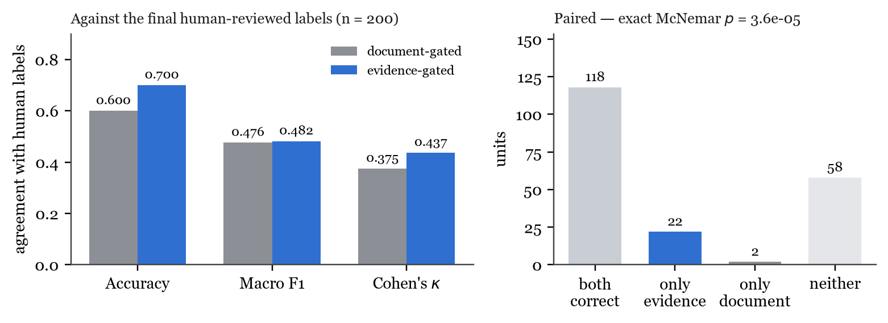
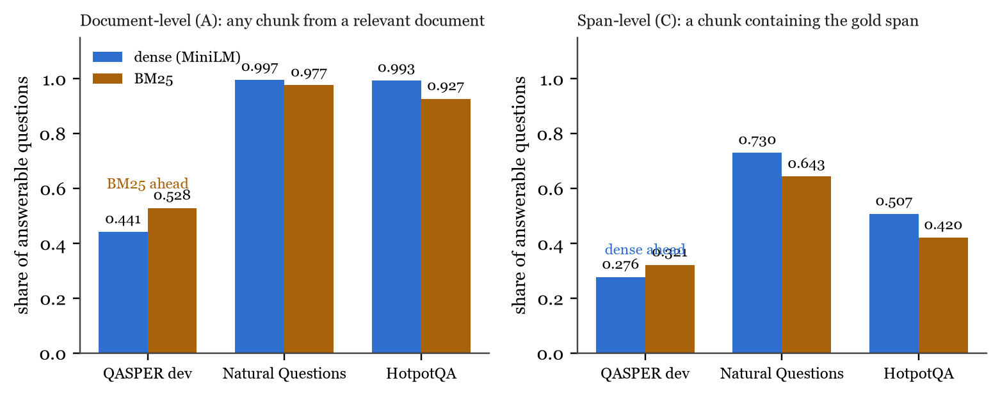
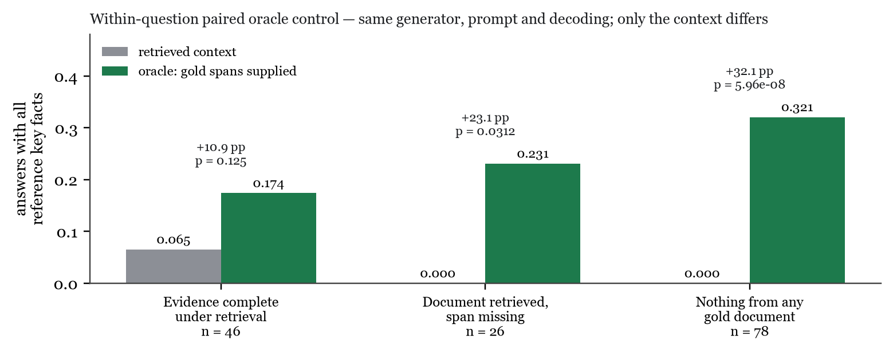
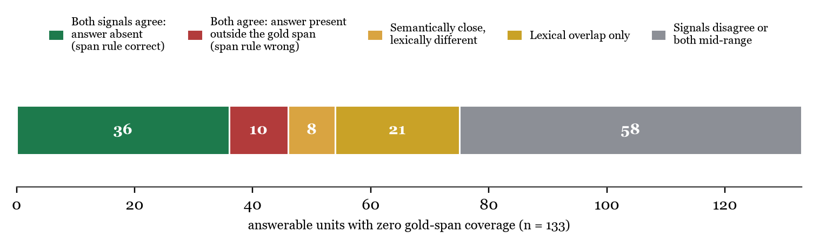

# TrustRAG — Evidence-Aware RAG Evaluation

[](https://github.com/pouyapd/TrustRAG/actions/workflows/ci.yml)


**A measurement-validity study of span-level evidence evaluation for retrieval-augmented
generation.** Document-level retrieval metrics ask *"did a chunk from the right document
arrive?"*. Span-level evidence metrics ask *"did the passage that actually supports the
answer arrive?"* That the first overstates retrieval success on long documents is
[established prior work](docs/paper/literature_review.md). This repository asks the
follow-up question: **what does span-level evaluation buy, what does it cost, and how far
can its own gold standard be trusted?**

> **Research question.** When RAG failure attribution is gated on span-level evidence
> rather than document-level retrieval, does it agree better with human judgement — and
> where does the span-based gold standard itself break down?



**Three verified findings.**

| | Result |
|---|---|
| **The definition can invert a system comparison** | On QASPER, BM25 retrieves relevant *documents* more often than a dense retriever (0.528 vs 0.441) and gold *spans* less often (0.183 vs 0.276; paired 52 vs 25, *p* = 0.003). The two metrics recommend different retrievers. |
| **Evidence-gating agrees better with humans — for retrieval attribution only** | Against 200 human-reviewed labels: accuracy **0.700 vs 0.600**, κ **0.437 vs 0.375**, paired **22 vs 2**, exact McNemar *p* < 0.0001. But only the retrieval classes are reliable: `wrong_retrieval` F1 0.907 against `ok` recall 0.094. |
| **The span-based gold standard is incomplete** | On units the span rule calls retrieval failures, two independent proxies agree the answer is present in the retrieved text in **7.5%** of cases, and disagree on a further **65%** that no automated signal resolves. |

**What this repository does not claim.** Evidence-aware RAG evaluation is not new here;
neither is the failure taxonomy, nor the oracle-evidence experiment (a
[replication](docs/paper/paper.md#6-oracle-evidence-control-replication) — 32.1% repair
against 32.8% published). See [literature_review.md](docs/paper/literature_review.md) for
what is and is not novel.

📄 **[Paper draft](docs/paper/paper.md)** · 🔬 **[Research overview PDF](docs/TrustRAG_Research_Overview.pdf)** · 📋 **[Reviewer simulation](docs/paper/reviewer_simulation.md)** · 🎯 **[Venue fit](docs/paper/venue_fit.md)**

---

## Contents

[Core insight](#core-insight) · [Methodology](#methodology) · [Results](#results) ·
[Human validation](#human-validation) · [Gold-span limits](#how-far-the-gold-standard-can-be-trusted) ·
[Datasets & setup](#datasets-and-experimental-setup) · [Reproducibility](#reproducibility) ·
[Install](#install-and-use) · [Tests](#tests) · [Limitations](#limitations)

---

## Core insight

A gold span and a retrieved chunk are half-open character intervals in the same
document. Overlap decides coverage — arithmetic, not string search:

```
document  qasper:1901.00001
gold span        [1200, 1760)
retrieved chunk  [ 900, 2100)   overlap = 560 chars  ->  evidence covered
retrieved chunk  [8300, 9500)   overlap =   0 chars  ->  same document, no evidence
```

Both chunks satisfy a document-level metric. Only the first makes the question
answerable from context. Three definitions of retrieval success follow:

- **A** — some chunk from a relevant document (the conventional metric)
- **B** — every document a multi-hop question requires
- **C** — a retrieved chunk actually contains the gold span

`C ≤ B ≤ A` by construction. A→B isolates a **quantifier** effect, B→C a **granularity**
effect, and the two are near-orthogonal: each is null on the corpus where the other
dominates.

## Methodology

Character offsets travel chunker → vector store → retrieval → stored record, so
`document[chunk.start:chunk.end] == chunk.text` holds by construction and is
property-tested. That is what makes span coverage computable after the fact.

The failure taxonomy has nine categories and one rule — R4 — that decides whether a row
is charged to retrieval. It reads a single boolean. **The document-gated variant binds it
to A; the evidence-gated variant binds it to C. Everything else is identical**, and both
labels are written to every row, so the comparison runs on identical retrieval output at
zero extra inference cost.

Design rationale: [docs/ARCHITECTURE.md](docs/ARCHITECTURE.md) ·
Taxonomy: [docs/TAXONOMY.md](docs/TAXONOMY.md)

## Results

### Retrieval decomposition

| Corpus | n | A | B | C | quantifier A→B | granularity B→C |
|---|---:|---:|---:|---:|---:|---:|
| QASPER dev | 290 | 0.441 | 0.441 | 0.276 | 0.0 pp | **16.6 pp** (p=7.1e-15) |
| Natural Questions | 300 | 0.997 | 0.997 | 0.730 | 0.0 pp | **26.7 pp** (p=1.7e-24) |
| HotpotQA | 150 | 0.993 | 0.507 | 0.507 | **48.7 pp** (p=2.1e-22) | 0.0 pp |
| 2WikiMultihopQA | 150 | — | — | — | **64.7 pp** (p=1.3e-29) | 1.3 pp (n.s.) |


### The definition can invert a retriever comparison



Same chunks, same questions, same depth. On QASPER a document-level evaluation
recommends BM25 and a span-level evaluation recommends the dense retriever,
significantly. Observed on one of three corpora — the claim is that inversion is
*possible*, not that it is general.

### Oracle-evidence control (a replication)

Every question answered twice by the same generator, same prompt, same decoding — only
the context differs (retrieved chunks vs the gold spans verbatim). Within-question
pairing removes question difficulty and generator identity as confounds.

| Stratum | n | retrieved | oracle | difference | p |
|---|---:|---:|---:|---:|---:|
| Evidence complete under retrieval | 46 | 0.065 | 0.174 | +10.9 pp | 0.125 (n.s.) |
| **Document retrieved, span missing** | 26 | **0.000** | **0.231** | **+23.1 pp** | 0.031 |
| Nothing from any gold document | 78 | 0.000 | 0.321 | +32.1 pp | 6.0e-08 |



The middle row is the argument: those 26 questions are scored as retrieval *successes* by
a document-level metric, the model got none right, and supplying the actual span repairs
23% of them. This replicates [arXiv:2608.08944](https://arxiv.org/html/2608.08944)
(32.8% repair over 11,105 failures) at n=150 with one reader and no sham control.

## Human validation

**Provenance matters here, so it is stated precisely.**

| Artifact | What it is |
|---|---|
| `annotator_human/completed.jsonl` | **Human**, original pass, 200 units |
| `review_43_flagged/annotator_review/` | **Human**, second review of 43 audit-flagged units |
| `final_human_reviewed/completed.jsonl` | **Derived**: original label where unflagged, review decision where flagged |
| `annotator_a/completed.jsonl` | **Automated** — a language-model annotator. Not ground truth. |

An audit against the written guidelines flagged 43 of 200 labels as conflicting with an
explicit rule. The annotator re-reviewed those 43 on full context: **36 changed, 7
upheld**. A per-unit provenance chain records `original → flag reason → review → final`.

**This is agreement with a guided expert reading, not independent validation.** The
annotator was told which units to re-examine and why, and the changes moved toward what
the guidelines prescribe. Reported honestly rather than as validation.

| Variant | Accuracy | 95% CI | Macro F1 | κ |
|---|---:|---:|---:|---:|
| Document-gated | 0.6000 | 0.531–0.665 | 0.4764 | 0.3752 |
| **Evidence-gated** | **0.7000** | 0.633–0.759 | **0.4819** | **0.4371** |

Per class, evidence-gated: `wrong_retrieval` F1 **0.907** (support 136),
`answered_when_unanswerable` F1 **1.000** (9), `partial_answer` 0.286 (22), `ok` 0.158
(32), `incorrect_answer` 0.059 (1).

> **Retrieval-side attribution is validated. Generation-side classification is not.** A
> [held-out threshold ablation](docs/paper/paper.md#71-threshold-ablation) (144
> configurations, 50/50 split) improves the evidence gate from 0.730 to 0.750 accuracy
> and does not rescue the generation classes — the rules, not the thresholds, are the
> larger problem.

Agreement with the *automated* reference pass is markedly higher (0.805, κ 0.631) than
agreement with humans. Two automated readings share failure directions; **the human
number is the one reported.**

Full detail: [human_validation_final.md](docs/paper/human_validation_final.md)

## How far the gold standard can be trusted



Over the 133 answerable units with zero gold-span coverage, two proxies — lexical
presence of the reference answer, and max sentence-level cosine similarity:

| Bucket | n | Share |
|---|---:|---:|
| Both agree the answer is absent — span rule correct | 36 | 27.1% |
| Both agree it is present outside the gold span — **span rule wrong** | 10 | 7.5% |
| Unresolved by either signal | 87 | 65.4% |

A lexical-only reading suggests 23.3%; requiring both proxies to agree gives 7.5%.
**Neither is the answer** — 65% needs human entailment judgement that has not been done.
QASPER marks supporting sentences, not every passage the answer can be derived from, so
span-gated attribution over-charges retrieval by an amount bounded but not pinned down.

## Datasets and experimental setup

| Dataset | Licence | Structure | Role |
|---|---|---|---|
| QASPER | CC BY 4.0 | NLP papers, ~22k chars | granularity |
| Natural Questions | CC BY-SA 3.0 | Wikipedia, ~37k chars | granularity |
| HotpotQA | CC BY-SA 4.0 | 10 paragraphs, 2 gold | quantifier |
| 2WikiMultihopQA | Apache-2.0 | 10 paragraphs, 2–4 gold | quantifier (replication) |

Chunk size 256, overlap 32, top-k 5, `all-MiniLM-L6-v2`; BM25 (Okapi, k1=1.5, b=0.75)
over identical chunks. Robustness: 4 embedders, depths k=1…20, chunk sizes 128/256/512.
Generators: deterministic extractive control; Qwen2.5-0.5B-Instruct and
SmolLM2-360M-Instruct locally. **Corpora are not redistributed** — loaders, checksums and
licences are committed ([docs/DATASETS.md](docs/DATASETS.md)).

Statistics: Wilson intervals, seeded bootstrap, **exact** McNemar for paired binary
comparisons, `MIN_N_FOR_INFERENCE = 30` as a stated convention. No multiple-comparison
correction is applied; the headline results survive one, the marginal ones would not.

## Reproducibility

```bash
python scripts/reproduce_study.py --all     # every retrieval experiment, no API key
```

Every table and figure maps to a command and an output file in
**[docs/paper/REPRODUCIBILITY.md](docs/paper/REPRODUCIBILITY.md)**. Reports embed git
commit, raw-file SHA-256, configuration, threshold fingerprint and package versions.

Two honest limits: `reports/` is gitignored, so the annotation artifacts behind the human
validation are produced locally rather than shipped; and approximate nearest-neighbour
search moves fine-grained aggregates by ≤0.001 between independently built indices
(headline figures reproduce exactly).

## Install and use

```bash
git clone https://github.com/pouyapd/TrustRAG.git && cd TrustRAG
pip install -r requirements.txt
python scripts/run_offline_eval.py      # end-to-end evaluation, ~30s, no key
pytest tests/ -q                        # 477 tests
```

<details>
<summary><b>All research commands</b></summary>

```bash
# retrieval study and robustness sweeps
python scripts/reproduce_study.py --all
python scripts/reproduce_study.py --embedder-sweep --topk-sweep --multihop

# BM25 baseline, scored under the same definitions
python scripts/run_bm25_baseline.py --dataset qasper \
    --raw data/raw/qasper-dev-v0.3.json --split dev --limit 300 \
    --dense-rows reports/experiments/qasper_dev_300/rows.jsonl \
    --dense-records reports/experiments/qasper_dev_300/inference.jsonl \
    --out results/bm25_qasper_dev_300.json

# paired oracle-evidence control
python scripts/run_oracle_evidence.py \
    --records reports/experiments/qasper_dev_300/inference.jsonl \
    --generator qwen0.5b --limit 150 --out reports/experiments/oracle_qasper_qwen

# annotation: build a blinded package, annotate locally, validate
python scripts/build_annotation_package.py --records ... --out ... --n-units 200
python scripts/annotate.py --annotator human --package ...
python scripts/annotate.py --annotator human --package ... --validate

# audit the labels, derive the final reviewed dataset, check the gold standard
python scripts/audit_human_annotations.py --package ... --annotator human --out ...
python scripts/build_final_human_dataset.py --original ... --review ... --out ...
python scripts/audit_gold_span_semantic.py --package ... --out ...
python scripts/threshold_ablation.py --package ... --labels ... --out ...

# figures
pip install -r requirements-research.txt
python scripts/make_figures.py --all && python scripts/make_paper_figures.py --all
```
</details>

## Tests

```bash
pytest tests/ -v --cov=src      # 477 tests, 80% line coverage, ruff clean
```

Unit tests, property-style invariants (span coverage implies document coverage, for every
record), end-to-end integration from a real dataset file through chunking and retrieval to
a failure label, and a regression test for every defect found during the work — including
a 600-character annotation truncation defect that hid 49% of retrieved evidence from
annotators and biased labels toward blaming retrieval.

CI runs lint, tests, an evaluation regression and a Docker build on every push.

## Limitations

Read before quoting anything above. Full list in
[docs/paper/paper.md#11-limitations](docs/paper/paper.md#11-limitations).

- **One annotator, and a guided review.** No inter-annotator agreement exists. The second
  pass was directed by an audit of the same guidelines being tested.
- **The span gold standard is incomplete** — 7.5% confirmed, 65% unresolved.
- **Generation-side categories are unvalidated**; three have zero support in the human
  labels, and the annotated run uses an extractive control that cannot hallucinate.
- **The core premise is prior art.** This is a measurement-validity study, not a new
  evaluation paradigm.
- **Two retrievers** (dense + BM25); no reranker, hybrid or late-interaction baseline.
- **One corpus and one configuration** for the human study; small generators (0.5B, 0.36B).
- **Targeted, not systematic, literature review.**
- **Not a deployed system** — containerised and CI-tested, never run at production scale.

## Documentation

| Document | Contents |
|---|---|
| [docs/paper/paper.md](docs/paper/paper.md) | Full paper draft |
| [docs/paper/literature_review.md](docs/paper/literature_review.md) | Novelty audit and comparison table |
| [docs/paper/human_validation_final.md](docs/paper/human_validation_final.md) | The complete human study |
| [docs/paper/reviewer_simulation.md](docs/paper/reviewer_simulation.md) | Three adversarial reviews and the fixes |
| [docs/paper/venue_fit.md](docs/paper/venue_fit.md) | Where this can realistically be submitted |
| [docs/paper/REPRODUCIBILITY.md](docs/paper/REPRODUCIBILITY.md) | Command → output map |
| [docs/EXPERIMENTS.md](docs/EXPERIMENTS.md) | Full protocol and threats to validity |
| [docs/TAXONOMY.md](docs/TAXONOMY.md) · [docs/EVALUATION.md](docs/EVALUATION.md) | Categories, rules, metric definitions |
| [docs/ANNOTATION_GUIDELINES.md](docs/ANNOTATION_GUIDELINES.md) | What annotators are asked to judge |
| [docs/DATASETS.md](docs/DATASETS.md) · [docs/QUICKSTART.md](docs/QUICKSTART.md) | Data provenance; install and run |

## Citation

A paper draft is in `docs/paper/paper.md`; it is **not published**. Cite the repository:

```bibtex
@software{bathaeipourmand_trustrag_2026,
  author = {Bathaei Pourmand, Pouya},
  title  = {TrustRAG: Evidence-Aware RAG Evaluation},
  year   = {2026},
  url    = {https://github.com/pouyapd/TrustRAG}
}
```

## License

MIT for this code. Evaluated corpora carry their own licences — see
[docs/DATASETS.md](docs/DATASETS.md).

## Author

Pouya Bathaei Pourmand — MSc researcher, Computer Engineering (AI), University of Genoa.
