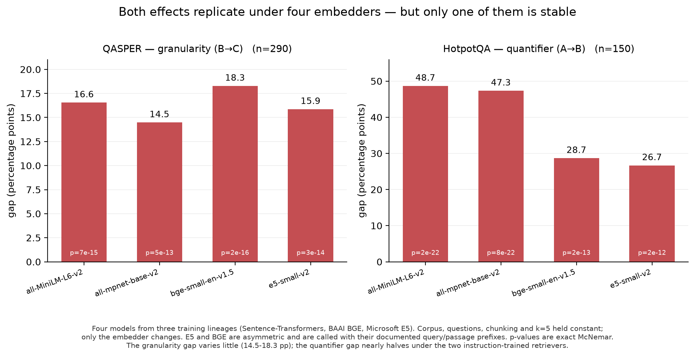
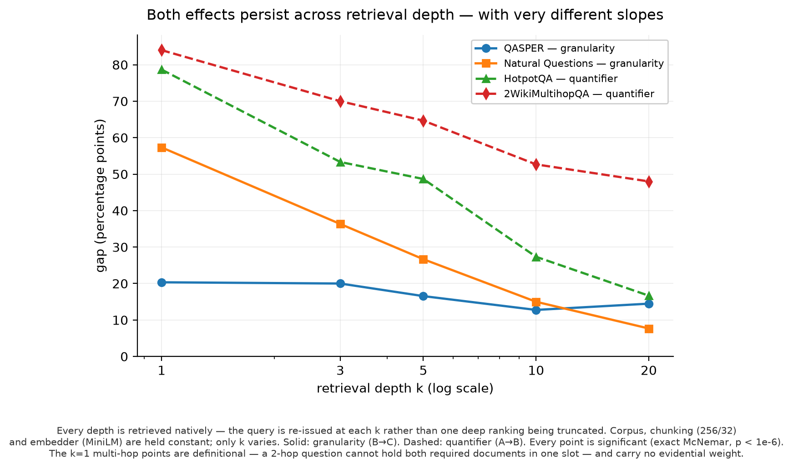

# TrustRAG — Evidence-Aware RAG Evaluation

[](https://github.com/pouyapd/TrustRAG/actions/workflows/ci.yml)


**A containerized RAG service (FastAPI + ChromaDB) with an evaluation layer that
tells you *why* a RAG answer failed — retrieval, evidence, generation or
abstention — instead of handing you one aggregate score.**

The system measures something most RAG evaluations do not: **not "did we
retrieve the right document?" but "did the passage that actually supports the
answer reach the generator?"** On corpora of long documents those come apart
badly. Measured on four public datasets, across four embedding models and five
retrieval depths, the gap is large, one-directional, and it moves where failures
get attributed — on Natural Questions, a document-level reading blames retrieval
for **1** failure out of 300; the evidence-level reading blames it for **81**.

Everything below runs offline, with no API key.


*Generated from the repository's own result files by
`scripts/make_pipeline_figure.py` — the numbers in the lower panels are read
from `reports/annotation/qasper_dev_300_full_context/`.*

---

## Project at a glance

| | |
|---|---|
| **Language** | Python 3.11+ |
| **API** | FastAPI — 5 endpoints (`/health`, `/metrics`, `/ingest`, `/query`, `/evaluate`) |
| **Vector store** | ChromaDB, persistent, offset-carrying chunks |
| **Embeddings** | 4 local models swept (MiniLM, MPNet, BGE, E5) + OpenAI + deterministic hash |
| **Generation** | OpenAI, Anthropic, local open weights, or a deterministic extractive control |
| **Observability** | Prometheus (6 metrics) + `structlog` structured JSON logging |
| **Packaging** | Docker + docker-compose; CPU-only image, 9.53 GB → **2.99 GB** |
| **CI** | GitHub Actions — 3 jobs: tests, evaluation regression, Docker build |
| **Testing** | **466 tests, 80% line coverage**, `ruff` clean, nothing excluded |
| **Codebase** | ~6,500 lines `src/`, ~2,900 lines `tests/`, 38 modules |
| **Offline mode** | Full evaluation with no API key and no network |
| **Datasets** | Natural Questions, QASPER, HotpotQA, 2WikiMultihopQA (loaders committed, corpora not) |
| **Annotation** | 200-unit blinded package, full retrieved context (1000/1000 chunks complete); 22 human-labelled units, model-generated reference set, provenance per file |

> **Branch note.** `main` carries the finalized state. The work was developed on
> **`research/stages-1-4`**, preserved at the same commit for provenance.

---

## See it running

**The service.** FastAPI with the RAG endpoints and the evaluation endpoint side
by side — captured from the live application, not a mockup:


**The pipeline.** Every push runs lint + tests, an end-to-end evaluation
regression, and a Docker build:


**The study.** `python scripts/reproduce_study.py --all` runs all five
experiments and prints this table. Verbatim output, no API key required:

```
experiment           chunks/doc   A doc  B quant  C span   quant    gran
qasper_dev_300               19   0.441    0.441   0.276    0.0p   16.6p
nq_val_300_fixed             31   0.997    0.997   0.730    0.0p   26.7p
hotpot_150                    2   0.993    0.507   0.507   48.7p    0.0p
qasper_c128                  43   0.445    0.445   0.259    0.0p   18.6p
qasper_c512                   9   0.428    0.428   0.317    0.0p   11.0p
```

`A` is the conventional document-level retrieval metric; `C` asks whether the
gold evidence span actually reached the generator. The two right-hand columns
separate *why* they differ — a multi-hop quantifier effect from a span
granularity effect.

---

## Quick start

No API key, no network, no corpora needed for the smoke test:

```bash
git clone https://github.com/pouyapd/TrustRAG.git && cd TrustRAG
pip install -r requirements.txt

python scripts/run_offline_eval.py      # end-to-end evaluation, ~30s
pytest tests/ -q                        # 466 tests
```

Run it as a service:

```bash
cp .env.example .env            # set OPENAI_API_KEY to enable /query
docker-compose up --build       # API on :8000, Prometheus on :9090
curl localhost:8000/health      # {"status":"ok","vectors_in_store":N,...}
```

`/health`, `/ingest` and `/metrics` need no API key — embeddings run locally via
`sentence-transformers`, downloaded on first use. `/query` calls a generator, so
it needs OpenAI, Anthropic or a local Ollama. **The evaluation layer never needs
a key**, which is why the study and CI run without one.

Full walkthrough: [docs/QUICKSTART.md](docs/QUICKSTART.md).

---

## What this demonstrates

**Engineering.** A service that is actually operable: pluggable providers behind
narrow interfaces, structured logging with request tracing, Prometheus metrics
wired to real code paths, a container that was cut from 9.53 GB to 2.99 GB by
installing the CPU PyTorch wheel before `sentence-transformers` could drag the
CUDA runtime in, and CI that fails on a lint violation, a broken test, an
evaluation regression, or an unbuildable image.

**Measurement design.** Separating inference from scoring so a finished run can
be re-scored under different thresholds with zero model calls. Carrying
character offsets end-to-end so evidence claims are arithmetic rather than
string search. Freezing the legacy metrics — defects documented — so old numbers
still reproduce while corrected ones run beside them.

**Research discipline.** The headline finding was originally overstated: the
first ablation changed two variables at once on multi-hop data. Decomposing it
into A/B/C reattributed HotpotQA's 48.7 pp from granularity to quantifier. That
correction is in the repository, in [docs/EXPERIMENTS.md](docs/EXPERIMENTS.md),
not quietly edited out. The [Limitations](#limitations) section is written to be
read before the results are quoted.

---

## Why this matters in real RAG systems

A team ships RAG, the dashboard says retrieval recall is 0.99, and users keep
reporting wrong answers. The instinct is to blame the model and start swapping
LLMs. That is often the wrong fix.

Document-level recall answers "did a chunk from the right document appear?" On a
37,000-character Wikipedia page, a chunk from anywhere in it passes — including
chunks that contain none of the evidence. The retrieval metric is green while
the generator is working from context that cannot support the answer.

This is the concrete cost:

| | Document-level reading | Evidence-level reading |
|---|---|---|
| Failures charged to retrieval (NQ, n=300) | 1 | **81** |
| Suggested fix | "improve the model" | "fix chunking / top-k / ranking" |

The same stored retrieval output, two definitions of success, opposite
engineering conclusions. TrustRAG reports both side by side and never lets one
overwrite the other — which is the difference between a metric you can act on
and a metric that makes you feel good.

It also refuses to credit ungrounded correctness: an answer that is right
*without* the gold evidence in context is charged to retrieval, not counted as a
success. On a Wikipedia-derived corpus that is the difference between measuring
RAG and measuring what the model already memorized.

---

## Architecture


```mermaid
flowchart TD
    Client([Client]) --> API

    subgraph Service["Service layer"]
        API["FastAPI · /ingest · /query · /evaluate · /health · /metrics"]
        OBS["structlog + Prometheus — latency · failure modes · vectors"]
        API -. emits .-> OBS
    end

    subgraph Pipeline["RAG pipeline — character offsets carried end to end"]
        CHUNK["Chunker · start_char / end_char"] --> STORE[("ChromaDB · vectors + offsets")] --> RETR["Retriever · top-k"] --> GEN["Generator · OpenAI · Anthropic · extractive control"]
    end

    subgraph Eval["Evaluation layer"]
        ALIGN["Evidence alignment · gold span ∩ retrieved chunk"] --> SCORE["Metrics + failure taxonomy v2 · legacy · corrected · evidence-level"] --> STATS["Statistics · Wilson · bootstrap · exact McNemar"]
    end

    API --> CHUNK
    GEN --> ALIGN
    STATS --> REPORT["Report + provenance block"]
```

Two things live in this repository:

- **A RAG service** — FastAPI, ChromaDB, pluggable providers, Prometheus,
  Docker. Ordinary, working, and not the interesting part.
- **A research evaluation layer** — position-aware evidence alignment, a
  versioned failure taxonomy, corrected retrieval metrics, an attribution
  hierarchy, and statistics that refuse to overstate small samples.

Design decisions and their rationale: [docs/ARCHITECTURE.md](docs/ARCHITECTURE.md).

---

## Engineering details

- **Modular pipeline** — `LLMProvider` / `EmbeddingProvider` interfaces; swapping
  OpenAI for Anthropic for a local model is a config change, not a refactor.
- **Container discipline** — 9.53 GB → **2.99 GB** (3.2×) by ordering the CPU
  PyTorch wheel ahead of `sentence-transformers`, so no CUDA runtime lands in an
  image with no GPU.
- **Observability** — `structlog` JSON logs with request tracing; Prometheus
  counters, histograms and gauges for query volume, latency, faithfulness,
  failure modes and vector-store size.
- **CI on every push** — lint, tests, an end-to-end evaluation regression that
  runs without API credits, and a Docker build.
- **Deterministic offline mode** — no API keys, no network; the same code path
  CI uses.
- **Provenance on every report** — git commit and dirty flag, raw-file SHA-256,
  split, sample size, chunk size, top-k, embedder and generator identity,
  taxonomy version and threshold fingerprint, Python version, platform and
  package versions.

---

## The research contribution

The question: *can RAG failures be decomposed into retrieval, evidence,
generation and abstention causes using reproducible, evidence-grounded
evaluation rather than a single aggregate score?*

### Method

**Character offsets travel the whole path.** Chunk text is *sliced* from the
source document, never rebuilt by decoding tokens, so
`document[chunk.start_char:chunk.end_char] == chunk.text` holds by construction.
Offsets survive chunker → vector store → retrieval → stored records.

Offsets are not recovered by searching for the chunk text. `str.find()` returns
the first occurrence, so in any document that repeats itself every copy resolves
to the same wrong position.

**Evidence alignment is arithmetic.** A gold span and a retrieved chunk are
half-open character ranges in one document; overlap decides coverage.

```
gold span [1200, 1760)  in doc qasper:1901.00001
retrieved chunk [900, 2100) in doc qasper:1901.00001
overlap = 560 chars  ->  covered
```

Multi-hop: under `all_required` every gold document must contribute a covered
span. Retrieving one of two required documents is a *retrieval* failure, not a
generation failure.

**Inference and scoring are separate.** Re-scoring a finished run costs no model
calls, which is what makes threshold-sensitivity analysis and methodology
comparison practical.

### Evaluation protocol

Three measurement layers, reported side by side, none overwriting another:

1. **Legacy** — frozen, with defects documented, so old numbers reproduce.
2. **Corrected** — explicit document vs chunk units; `None` instead of 0.0 for
   unanswerable questions; nDCG, hit-rate, first-relevant-rank.
3. **Evidence-level** — span coverage, evidence recall/precision, first evidence
   rank, multi-hop completeness.

See [docs/EVALUATION.md](docs/EVALUATION.md).

### Datasets

Four corpora, chosen because they differ structurally — agreement across them is
what makes a result more than a property of one dataset.

| Dataset | Licence | Structure | Role |
|---|---|---|---|
| Natural Questions | CC BY-SA 3.0 | Wikipedia pages, span evidence, ~37k chars | Granularity |
| QASPER | CC BY 4.0 | Scientific papers, paragraph evidence, ~22k chars | Granularity |
| HotpotQA | CC BY-SA 4.0 | 10 paragraphs, 2 gold, 2-hop | Quantifier |
| 2WikiMultihopQA | Apache-2.0 | 10 paragraphs, 2–4 gold, 2- and 4-hop | Quantifier (replication) |

The two multi-hop sets are deliberately not two of the same thing: HotpotQA's
questions were written by crowdworkers reading the paragraphs, 2Wiki's are
generated from Wikidata relation paths and templated. They carry different
biases, so agreement between them is worth more than a third crowdsourced set.

**Corpora are not redistributed.** `data/raw/` is git-ignored; loaders, checksums
and licence metadata are committed instead. Download commands, checksums, split
discipline and contamination analysis are in
[docs/DATASETS.md](docs/DATASETS.md).

### Failure taxonomy

Nine categories including `incorrect_answer` separated from `partial_answer`,
`answered_when_unanswerable`, and `ok_abstained` as an explicit success.
Thresholds are versioned and hashable; every row records the rule that fired and
the features behind it. See [docs/TAXONOMY.md](docs/TAXONOMY.md).

---

## Experimental results

Three definitions of "retrieval succeeded", applied to the **same** stored
retrieval output. **A** is the conventional metric (any chunk from any relevant
document). **B** additionally requires every document a multi-hop question
needs. **C** requires that a retrieved chunk actually contained the gold span.
A→B isolates the *quantifier*; B→C isolates the *granularity*.

| | QASPER dev | NQ validation | HotpotQA |
|---|---|---|---|
| n | 290 | 300 | 150 |
| median chunks per gold document | 19 | 31 | **2** |
| A document, ANY | 0.441 | 0.997 | 0.993 |
| B document, quantified | 0.441 | 0.997 | **0.507** |
| C span, quantified | 0.276 | 0.730 | 0.507 |
| **quantifier A→B** | 0.0 pp | 0.0 pp | **48.7 pp** (p=2.1e-22) |
| **granularity B→C** | **16.6 pp** (p=7.1e-15) | **26.7 pp** (p=1.7e-24) | 0.0 pp |

Two distinct blind spots in conventional retrieval metrics, each showing up on
the data where it bites:

- **Granularity blindness** — on long documents, retrieving the document is not
  retrieving the evidence.
- **Quantifier blindness** — on multi-hop questions, retrieving *a* relevant
  document counts as success when the question needs *all* of them.

Discordance is one-directional everywhere (48/0, 80/0, 73/0): span-level success
implies document-level success, never the reverse.


### It is robust, and the two effects behave differently

Three things were varied, one at a time, with everything else held constant.

**Four embedding models, three training lineages.** On QASPER the granularity gap
ranges 14.5–18.3 pp (MiniLM 16.6, MPNet 14.5, BGE 18.3, E5 15.9), significant and
strictly one-directional in every case. On HotpotQA the quantifier gap ranges far
more — 48.7 pp down to 26.7 pp — because the two instruction-trained retrievers
are much better at getting *all* the required documents into the window (B rises
0.507 → 0.727 while A stays at 0.993).

> Granularity blindness is a property of chunking against document length, and a
> better encoder does not fix it. Quantifier blindness *is* substantially
> mitigated by a better multi-hop retriever — though not eliminated, and the
> conventional metric reports 0.993 for the best and worst configuration alike.



**Five retrieval depths, k = 1 to 20, each retrieved natively.** Retrieving more
does help, and the honest summary is that the magnitude is strongly k-dependent
while the distinction is not. On NQ the gap falls from 57.3 pp to 7.7 pp; on
QASPER it barely moves (20.3 → 14.5 pp); on 2WikiMultihopQA it is still 48.0 pp
at k=20. Every point remains significant.

> The more telling result: on NQ and HotpotQA the conventional metric
> **saturates at A = 1.000 by k=10**. A metric with zero variance cannot rank
> systems or diagnose regressions. At NQ k=20 it charges **0** failures to
> retrieval while the evidence-level reading still charges **23**.



**A second multi-hop corpus.** The quantifier effect was measured on HotpotQA
alone. On 2WikiMultihopQA it replicates and is **larger — 64.7 pp**
(p = 1.3e-29, 97/0 discordant), with a mechanical explanation predicted from the
data: 28 of its 150 questions are 4-hop, so more documents are required and
"any" diverges further from "all". Its granularity gap is 1.3 pp and **not
significant** (p = 0.5) — reported as a null result, and exactly what its
232-character documents predict.

**The granularity effect is mechanistically explained and predicted.** It scales
with how many chunks a gold document spans — varying chunk size on QASPER, same
corpus and questions throughout:

| chunk size | chunks per gold doc | granularity gap |
|---|---|---|
| 128 | 43 | 18.6 pp |
| 256 | 19 | 16.6 pp |
| 512 | 9 | 11.0 pp |
| HotpotQA paragraphs | 2 | 0.0 pp |

So the gap **is** sensitive to chunk size, in a predictable and explained way,
and does not vanish at any realistic setting — at 512 tokens it is still 11 pp
(p = 4.7e-10). It is a property of corpus structure relative to chunk size, not
a universal constant.

Attribution moves accordingly, on every corpus:

| Corpus | n | retrieval (document-level) | retrieval (evidence-level) |
|---|---|---|---|
| QASPER | 290 | 162 | **210** |
| Natural Questions | 300 | 1 | **81** |
| HotpotQA | 150 | 1 | **74** |
| 2WikiMultihopQA | 150 | 5 | **104** |

QASPER is the informative exception: retrieval there is visibly poor under both
readings, so the conventional metric is not misleading in the same way — which is
itself evidence that this is about corpus structure rather than a universal
correction.


Full protocol, dataset census, threats to validity and reproduction commands:
[docs/EXPERIMENTS.md](docs/EXPERIMENTS.md).

### A real language model, and what evidence status predicts

Everything above uses a deterministic extractive control. To ask what a *language
model* does when the supporting passage never reaches it, the stored QASPER run
is replayed with only the generator swapped — retrieval, context and questions
identical by construction. Two models, different vendors, both greedy on CPU,
n=150 each.

**Qwen2.5-0.5B-Instruct:**

| Evidence that reached the generator | n | correct | abstained | answered |
|---|---|---|---|---|
| Complete — every required span arrived | 44 | **18.2%** | 9.1% | 90.9% |
| **Document retrieved, span missing** | 26 | **0.0%** | **0.0%** | **100%** |
| Nothing from any gold document | 75 | 1.3% | 4.0% | 96.0% |

| Generator | P(correct \| complete) | P(correct \| incomplete) | difference | p |
|---|---|---|---|---|
| Qwen2.5-0.5B | 0.182 | 0.010 | **17.2 pp** | 0.0004 |
| SmolLM2-360M | 0.136 | 0.030 | **10.7 pp** | 0.023 |

The middle row of the first table is the argument in one line. Those 26 questions
are exactly what a document-level metric scores as retrieval *success*. Qwen
answered every one, never abstained, and was never right — and a conventional
evaluation would charge all 26 to the generator.

The direction replicates on both models. Neither abstains much when the evidence
is missing: SmolLM declined on **none** of the 101 questions whose evidence never
arrived.

**What this does not show.** These are small local models (0.5B and 0.36B),
chosen because no API key was available. Absolute accuracy is low even with
complete evidence — a property of the generator, not the retrieval — and with
n=150 split across strata neither run is powered to compare the two models.
**No hallucination rate, faithfulness benchmark, or model ranking is claimed.**

### Statistical uncertainty

Wilson intervals for proportions, seeded bootstrap for means, **exact** McNemar
for paired binary comparisons, permutation tests for failure-mode distributions.
Every estimate carries `n`, an interval and a `sufficient` flag;
`MIN_N_FOR_INFERENCE = 30` is a stated convention, not a theorem. Reports detect
and state saturated metrics, zero-variance metrics and rare categories in their
own output.

---

## Validating the taxonomy: annotation, provenance and context integrity

The taxonomy assigns every row a cause. Nothing in the pipeline proves those
assignments are right, so the labels are checked against an independent
annotation of the same units — with the boundary between *human* and
*model-generated* labels recorded explicitly, because a taxonomy that grades its
own homework measures nothing.

### The protocol

`scripts/build_annotation_package.py` emits a blinded package: 200 units
stratified so every proposed failure mode is represented, 25% of the budget
reserved for rows within 0.1 of a deciding threshold, per-annotator shuffles, and
the system's proposed label withheld in a separate key file. `scripts/annotate.py`
serves a local, offline annotation interface, writes after every change, and
cannot read the withheld key — the page is built from an explicit field
allowlist. Categories are defined in [docs/ANNOTATION_GUIDELINES.md](docs/ANNOTATION_GUIDELINES.md)
in terms of what is visible on the page, deliberately *not* in the language of
the rules being tested.

### Full retrieved context — a bug that made step 2 unanswerable

The first package stored `chunk.text[:600]` for each retrieved chunk while
recording the chunk's full `char_range`. Annotators were therefore answering the
central question — *did the supporting passage reach the generator?* — from a
prefix of what the generator actually saw. Evidence past the cut was
indistinguishable from evidence never retrieved.

The builder now stores each retrieved chunk complete, records `n_chars` and
`text_complete` per chunk, and **refuses to write a package** in which any chunk
holds less text than its `char_range` covers. `scripts/audit_annotation_truncation.py`
reconstructs the old package against the source records and reports what was
hidden:

| | |
|---|---|
| Retrieved chunks audited | 1000 |
| Cut at the 600-character display limit | 941 |
| Recovered from source records | 941 |
| Complete after the rebuild | **1000 / 1000** |
| Unreconstructable | 0 |
| Characters visible to the annotator | 588,671 → **1,163,638** |

Roughly half the retrieved evidence had been invisible. `--validate` now reports
context completeness on every run, and `tests/test_annotation_package_no_truncation.py`
fails if a fixed slice is reintroduced into the builder.

### What has been labelled, and by whom

| Label set | Units | Produced by |
|---|---|---|
| `qasper_dev_300/annotator_a` — human subset | 22 | **Human** (project owner, via the annotation interface) |
| `qasper_dev_300/annotator_a` — remainder | 178 | Model |
| `qasper_dev_300/annotator_b` | 200 | Model |
| `qasper_dev_300_full_context/annotator_a` — **current reference set** | 200 | Model, on full retrieved context |

Every one of those files ships a `PROVENANCE.md` stating its origin. **The
200-unit reference set is a model-generated pass, not a human annotation pass**,
and is described that way everywhere it is used.

Agreement figures, all read from the reports those commands write (`reports/` is
gitignored, so they are produced locally rather than shipped with a clone):

- **Two independent passes over the truncated package** — Cohen's kappa
  **0.8365**, 92.5% raw agreement, 15 disagreements adjudicated against the
  guidelines (`final_agreement_report.json`).
- **Full-context reference set vs the 22 genuinely human labels** — 20/22
  identical (90.9%, kappa 0.74). With n=22 this is directional, not a validation.
- **Full-context reference set vs the earlier passes** — kappa 0.777 (A),
  0.810 (B), 0.871 (adjudicated).

Restoring the full context moved 13 of 200 labels, **10 of them from
`wrong_retrieval` to `incorrect_answer`** — units where evidence hidden past the
600-character cut turned out to have reached the generator. No label moved the
other way, which is the direction the bug predicts.

### The taxonomy scored against that reference set

`scripts/score_against_reference.py` scores the system's proposed labels over all
200 units — not only the subset two passes agreed on — and writes
`final_evaluation.json`:

**accuracy 0.7400 · macro F1 0.6223 · n = 200**

| Category | Support | Predicted | Precision | Recall | F1 |
|---|---|---|---|---|---|
| `answered_when_unanswerable` | 9 | 9 | 1.000 | 1.000 | 1.000 |
| `wrong_retrieval` | 130 | 100 | 1.000 | 0.769 | 0.870 |
| `incorrect_answer` | 42 | 57 | 0.561 | 0.762 | 0.646 |
| `ok` | 16 | 8 | 0.750 | 0.375 | 0.500 |
| `partial_answer` | 3 | 18 | 0.056 | 0.333 | 0.095 |
| `hallucination` | 0 | 8 | 0.000 | — | — |

The system never *wrongly* assigns `wrong_retrieval` (precision 1.000) but misses
23% of it: 30 units the reference calls a retrieval failure are charged to
generation instead — 22 `incorrect_answer`, 5 `partial_answer`, 2
`hallucination`, 1 `ok`. It also emits `hallucination` 8 times where the
reference uses it never, and over-predicts `partial_answer` 18× against a support
of 3. Those are the concrete places the thresholds need work, and they are
visible only because the reference set exists.

### Changing one gate, scored against the same reference set

The same stored run also carries `failure_mode_evidence`, which gates the
retrieval rule on whether a chunk covering the gold span arrived rather than on
whether a chunk from a relevant document arrived. Both variants are scored
against the same 200 reference labels:

| Variant | Accuracy | Macro F1 | Cohen's kappa |
|---|---|---|---|
| Document-gated (`failure_mode_v2`) | 0.740 | 0.622 | 0.573 |
| **Evidence-gated (`failure_mode_evidence`)** | **0.805** | **0.630** | **0.631** |

Paired over the same units: 139 both correct, 22 only evidence-gated, 9 only
document-gated, 30 neither. Exact McNemar on the 31 discordant pairs,
**p = 0.029**. The gain is concentrated in `wrong_retrieval` recall
(0.769 → 0.938) and costs precision there (1.000 → 0.917). Of the 30 units the
document-gated variant misattributes, 22 have `evidence_status = none` — the
pipeline had already recorded that nothing usable arrived.

Reproduce with `scripts/score_against_reference.py --rows … --records …`; it
re-reads stored labels and costs no model calls.

**What this is not.** With one reference pass and 22 human labels, this is a
consistency check on the taxonomy, not a human validation of it. A second
independent human pass is what would turn it into one. The paper-facing write-up of
this result — with every number sourced, and the gaps named rather than filled —
is in [docs/paper/](docs/paper/).

---

## Limitations

Read these before quoting anything above.

- **The generation experiment uses small local models.** No API key was
  available, so the reproducible baseline is a deterministic extractive control
  and the real-language-model runs use open weights of 0.36B and 0.5B
  parameters. Enough to ask whether evidence status predicts generation failure;
  **not** enough to characterise any deployed or frontier model. **No
  hallucination rate, no faithfulness benchmark and no model comparison is
  claimed.** Retrieval and evidence results are unaffected — retrieval is real
  and is held fixed while the generator changes.
- **The taxonomy is not yet validated against a full human reference set.** Its
  thresholds were tuned by inspection on a 20-question fixture, which is
  development data. The annotation protocol — stratified blinded package,
  written guidelines, kappa and per-category scoring — exists, is tested, and
  has now been run over 200 units. **But only 22 of those units carry human
  labels; the other 178, and the 200-unit full-context reference set the
  taxonomy is currently scored against, were labelled by a model.** Every
  provenance file under `reports/annotation/` states which is which, and nothing
  in this README calls a model pass a human pass. The headline retrieval result
  does not depend on the taxonomy thresholds; every generation-side label does.
- **The magnitude depends heavily on retrieval depth.** Embedder and k are now
  swept and both matter. On Natural Questions the granularity gap falls from
  57.3 pp at k=1 to 7.7 pp at k=20; on QASPER it barely moves (20.3 → 14.5 pp);
  on 2WikiMultihopQA the quantifier gap is still 48.0 pp at k=20. The
  distinction stays significant everywhere measured, but anyone quoting a single
  number is quoting one configuration. Reranking, query expansion and hybrid
  retrieval are untested and could shrink it further.
- **Four embedders, all small and all English.** MiniLM, MPNet, BGE-small and
  E5-small span three training lineages but not the space: no multilingual
  model, no large retriever, no domain-adapted scientific embedder.
- **Each effect rests on limited data.** Granularity is shown on two corpora,
  four chunk sizes, four embedders and five depths; the quantifier effect on two
  multi-hop corpora. Both multi-hop sets carry known biases — HotpotQA's
  crowdworkers wrote questions while looking at the paragraphs, and
  2WikiMultihopQA's are generated from Wikidata relation paths and templated.
  They fail differently, which is why agreement between them is worth more than
  a third crowdsourced set, but neither is a natural query distribution.
- **`C ≤ B ≤ A` is true by construction and is not the finding.** Span coverage
  implies document coverage. What is measured is the *magnitude* of the gap, its
  dependence on corpus structure, its behaviour under embedder and depth, and
  its consequence for attribution — not the existence of an inequality.
- **At k=1 the multi-hop result is definitional.** A two-hop question cannot have
  both required documents in one retrieved slot, so B = 0.000 there follows from
  the pigeonhole principle. That row carries no evidential weight; k=10 and k=20
  do.
- **Contamination is mitigated, not eliminated.** NQ and both multi-hop corpora
  derive from Wikipedia.
- **Sample sizes are moderate** (n = 290 / 300 / 150 / 150). Adequate for the
  paired comparisons reported; not a benchmark-scale study.
- **Retrieval is approximate.** Two independently built indices over the same
  corpus can rank one borderline question differently — a one-in-three-hundred
  difference that moves chunk-level aggregates by ≤0.001 and changes no reported
  gap. See [Reproducibility](#reproducibility).
- **Not a deployed system.** It is containerized, instrumented and CI-tested, but
  it has not been run at production scale or under production load.

---

## Reproducibility

`python scripts/reproduce_study.py --all` runs every experiment and prints the
results table above. **No API key is required**: the embedder runs locally and
the generator is a deterministic extractive control, so every retrieval and
evidence measurement reproduces offline once the corpora are downloaded.

Determinism is verified rather than assumed, and the verification found a limit
worth stating. Re-running the whole study from scratch — fresh index, fresh
embeddings, fresh retrieval — reproduced **every headline A/B/C figure exactly**
(QASPER 0.441/0.441/0.276, NQ 0.997/0.997/0.730, HotpotQA 0.993/0.507/0.507),
and HotpotQA reproduced bit-identically throughout.

What does *not* reproduce to the last digit are fine-grained aggregates on the
long-document corpora: chunk precision, chunk recall and nDCG move by ≤0.001, and
answer-side means such as faithfulness by ≤0.001. The cause is approximate
nearest-neighbour search — two independently built indices over the same corpus
can rank one borderline question differently, which is a one-in-three-hundred
difference. It changes no reported gap, no significance test and no conclusion,
but "reproduces exactly" would be too strong a claim and is not made here.

Curated per-run summaries are tracked in `results/`; raw corpora, vector indices
and full reports are git-ignored.

---

## All commands

```bash
pip install -r requirements.txt

# THE STUDY: all five original experiments. No API key needed.
# Fetch the corpora first - see docs/DATASETS.md for commands + checksums.
python scripts/reproduce_study.py --all

# The robustness experiments, also deterministic and key-free
python scripts/reproduce_study.py --embedder-sweep   # 4 models, 3 lineages
python scripts/reproduce_study.py --topk-sweep       # k = 1, 3, 5, 10, 20
python scripts/reproduce_study.py --multihop         # 2WikiMultihopQA
python scripts/reproduce_study.py --everything       # all of the above

# Deterministic offline smoke test, no keys, no network, no corpora
python scripts/run_offline_eval.py

# Re-score a finished run under different thresholds - no model calls
python scripts/reclassify.py --records reports/inference.jsonl \
    --out reports/sweep --sweep-faithfulness 0.3,0.6,0.9

# A real experiment (see docs/DATASETS.md for the data first)
python scripts/run_experiment.py --dataset qasper \
    --raw data/raw/qasper-dev-v0.3.json --split dev \
    --limit 60 --embedder minilm --out reports/experiments/qasper

# Paired methodology comparison
python scripts/run_ablation.py \
    --records reports/experiments/qasper/inference.jsonl \
    --out reports/experiments/ablation_qasper.json

# Annotation package: 200 stratified, blinded units, two annotator sheets, every
# retrieved chunk stored complete. Emits empty labels; nothing here writes one.
# The build aborts if any chunk holds less text than its char_range covers.
python scripts/build_annotation_package.py \
    --records reports/experiments/qasper_dev_300/inference.jsonl \
    --out reports/annotation/qasper_dev_300_full_context --n-units 200

# Annotate locally. Serves one unit at a time, writes after every change, and
# cannot read the withheld proposed-labels key.
python scripts/annotate.py --annotator a \
    --package reports/annotation/qasper_dev_300_full_context
python scripts/annotate.py --annotator a \
    --package reports/annotation/qasper_dev_300_full_context --validate

# Audit an existing package for display truncation against the source records.
python scripts/audit_annotation_truncation.py \
    --records reports/experiments/qasper_dev_300/inference.jsonl \
    --old-package reports/annotation/qasper_dev_300 \
    --new-package reports/annotation/qasper_dev_300_full_context \
    --out reports/annotation/qasper_dev_300_full_context/TRUNCATION_AUDIT.json

# Two annotators against each other: Cohen's kappa, confusion matrix, adjudication.
# Refuses to run on empty sheets rather than inventing a table.
python scripts/score_annotations.py \
    --package reports/annotation/qasper_dev_300 \
    --annotator a=.../annotator_a/completed.jsonl \
    --annotator b=.../annotator_b/completed.jsonl

# The taxonomy against one reference set, over all units rather than the agreed
# subset, plus agreement with any other completed passes.
python scripts/score_against_reference.py \
    --package reports/annotation/qasper_dev_300_full_context \
    --reference .../qasper_dev_300_full_context/annotator_a/completed.jsonl \
    --compare adjudicated=.../qasper_dev_300/final_adjudicated_labels.jsonl

# Regenerate the README pipeline/evaluation figure from those result files
python scripts/make_pipeline_figure.py \
    --package reports/annotation/qasper_dev_300_full_context \
    --out docs/figures/pipeline_evaluation.png

# Figures, and the documentation's result tables regenerated from result files
pip install -r requirements-research.txt
python scripts/make_figures.py --all
python scripts/report_tables.py --inject docs/EXPERIMENTS.md

# OPTIONAL: real-language-model generation study. Retrieval is reused verbatim
# from a finished run, so only the generator changes. Never runs in CI.
python scripts/run_llm_experiment.py \
    --records reports/experiments/qasper_dev_300/inference.jsonl \
    --generator qwen0.5b --limit 150 --out reports/experiments/llm_qasper_qwen
# ... or openai:gpt-4o-mini / anthropic:claude-3-5-haiku with a key in the env

pytest tests/ -v --cov=src
```

**466 tests, 80% line coverage**, ruff clean. Nothing is excluded from the
coverage report. The suite includes unit tests, property-style invariants (span
coverage implies document coverage, for every record), end-to-end integration
tests that carry a question from a real dataset file through chunking, a real
vector store and retrieval to a failure label, and regression tests for each
defect found during the work.

---

## Documentation

| Document | Contents |
|---|---|
| [docs/QUICKSTART.md](docs/QUICKSTART.md) | Install, run the service, first query |
| [docs/ARCHITECTURE.md](docs/ARCHITECTURE.md) | Design decisions and their rationale |
| [docs/EVALUATION.md](docs/EVALUATION.md) | Metric definitions and the three measurement layers |
| [docs/EXPERIMENTS.md](docs/EXPERIMENTS.md) | Full protocol, results, corrections, threats to validity |
| [docs/DATASETS.md](docs/DATASETS.md) | Download commands, checksums, licences, contamination analysis |
| [docs/TAXONOMY.md](docs/TAXONOMY.md) | The nine failure categories, decision rules, and the human-validation protocol |
| [docs/ANNOTATION_GUIDELINES.md](docs/ANNOTATION_GUIDELINES.md) | What annotators are asked to do, and how the categories are defined independently of the rules |
| [docs/SAMPLE_EVALUATION.md](docs/SAMPLE_EVALUATION.md) | The bundled smoke-test fixture, annotated |
| [docs/paper/](docs/paper/) | Paper-facing write-up: outline, setup, results, tables, figures, limitations, reproducibility |

---

## License

MIT (this code). The evaluated corpora carry their own licences — see
[docs/DATASETS.md](docs/DATASETS.md).

## Author

Pouya Bathaei Pourmand — ML Engineer, safe AI and evaluation.
