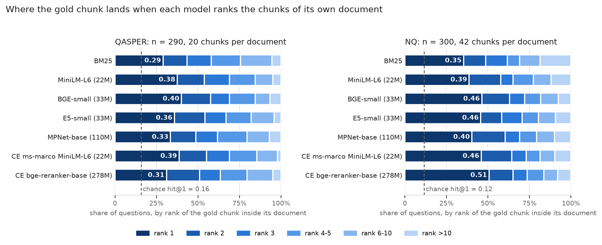

# Within-document evidence localisation: QASPER and Natural Questions

Status: complete on two corpora under one protocol. Every table below is generated by
`scripts/localisation_report.py` from the per-question rows in this directory; the prose
quotes those tables. No number here is carried over from an earlier draft.

*Rounding note (21 September 2026).* `summary_*.json` store values to four decimals and
`summary_*.md` re-round them to three, which differs from rounding the exact fraction in
four cells: MPNet hit@1 on QASPER is 97/290 = 0.334 (not 0.335), BM25-with-document-local-IDF
hit@5 on QASPER is 213/290 = 0.734 (not 0.735), bge-reranker-base MRR on QASPER rounds to
0.514 (not 0.513), and the Wilson interval of the ms-marco cross-encoder's hit@1 on NQ is
[0.404, 0.517]. The tables below and `hit_at_k_*.json` use the exact values; the generated
`summary_*.md` files are left as the script wrote them.

## The question

When a retriever has reached the right document, how often does it rank the passage
that carries the answer *first* — and does that depend on which retriever it is?

Document-level metrics cannot see this. Span-level metrics see it but conflate it with
*reach* (finding the document among others). This study isolates it: for every
answerable question, every chunk of the question's gold document is ranked against the
question and the rank of the first chunk overlapping a gold span is recorded. Ranking is
restricted to the gold document, so no other document competes, and the chance level is
computed analytically from the document's geometry.

## Protocol — identical on both corpora

| | |
|---|---|
| Chunking | 256 cl100k tokens, overlap 32 (`DocumentChunker`); offsets verified `document[start:end] == chunk.text`, zero mismatches |
| Gold | QASPER: evidence paragraphs (any one suffices); NQ: first long answer. Both paragraph-level, resolved to character ranges |
| Gold chunk | any chunk whose character range overlaps a gold span by ≥ 1 character |
| Localisation rank | rank of the first gold chunk when *all* chunks of the gold document are ordered by the model's score (first gold document if a question cites several) |
| Chance | analytic expectation under a random ordering of the document's D chunks with m gold chunks |
| Lexical | Okapi BM25, k1 = 1.5, b = 0.75, corpus-level IDF, `[a-z0-9]+` tokens on lowercased text |
| Dense | cosine on L2-normalised vectors; chunk vectors read from the stored Chroma indexes where they exist (QASPER: all four; NQ: MiniLM) and otherwise encoded once and cached in `data/build/nq_val_300_vectors/`; query prefixes as registered in `src/rag/embedders.py` |
| Cross-encoders | `sentence_transformers.CrossEncoder`, max_length 512, batch 32, CPU |
| Randomness | none — stable argsort of deterministic scores; there is no seed to record |
| Statistics | exact McNemar on hit@1 discordant pairs, Holm-adjusted over all 21 pairs; exact sign test on reciprocal-rank differences; Wilson 95% intervals; Spearman on within-document ranks |
| Models, both corpora | BM25 · MiniLM-L6 (22M) · BGE-small (33M) · E5-small (33M) · MPNet-base (110M) · cross-encoder ms-marco-MiniLM-L-6 (22M) · bge-reranker-base (278M) |

Nothing was tuned per corpus. What differs is what the datasets impose: document length
(20 vs 42 chunks per gold document), spans per question (QASPER cites more than one
paragraph for half its questions; NQ one long answer) and domain (NLP papers vs
Wikipedia). Model revisions were not pinned at run time; the revisions the local cache
resolved, their input limits and their documented training data are recorded in
`model_metadata.json` (see Robustness checks).

## Results



### QASPER dev

**QASPER** — 290 answerable questions with locatable gold spans, 111 documents, 2272 chunks of 256 tokens (overlap 32); 20.0 chunks per gold document, 2.79 gold-overlapping chunks per document.

| Model | Family | Params | hit@1 [95% CI] | hit@3 | hit@5 | MRR | median rank | ranks 2–5 | lift@1 |
|---|---|---:|---|---:|---:|---:|---:|---:|---:|
| chance | — | — | 0.157 | 0.403 | 0.580 | 0.347 | — | — | 1.00 |
| BM25 (Okapi, k1=1.5, b=0.75) | lexical | — | 0.290 [0.240, 0.344] | 0.579 | 0.755 | 0.481 | 3 | 0.466 | 1.84 |
| sentence-transformers/all-MiniLM-L6-v2 | dense bi-encoder | 22M | 0.376 [0.322, 0.433] | 0.690 | 0.845 | 0.562 | 2 | 0.469 | 2.39 |
| BAAI/bge-small-en-v1.5 | dense bi-encoder | 33M | 0.400 [0.345, 0.457] | 0.690 | 0.845 | 0.579 | 2 | 0.445 | 2.54 |
| intfloat/e5-small-v2 | dense bi-encoder | 33M | 0.359 [0.306, 0.415] | 0.669 | 0.821 | 0.549 | 2 | 0.462 | 2.28 |
| sentence-transformers/all-mpnet-base-v2 | dense bi-encoder | 110M | 0.334 [0.283, 0.391] | 0.617 | 0.797 | 0.518 | 3 | 0.462 | 2.13 |
| cross-encoder/ms-marco-MiniLM-L-6-v2 | cross-encoder | 22M | 0.386 [0.332, 0.443] | 0.690 | 0.855 | 0.573 | 2 | 0.469 | 2.46 |
| BAAI/bge-reranker-base | cross-encoder | 278M | 0.310 [0.260, 0.366] | 0.634 | 0.797 | 0.514 | 2 | 0.486 | 1.97 |
| *BM25 with document-local IDF* | variant | — | 0.286 | 0.562 | 0.734 | 0.474 | 3 | 0.448 | 1.82 |
| *RRF(BM25, BGE-small), k=60* | variant | — | 0.345 | 0.679 | 0.814 | 0.540 | 2 | 0.469 | 2.19 |
| *best-of(BM25, dense partner) per question - a ceiling, not a system* | variant | — | 0.503 | 0.772 | 0.903 | 0.663 | 1 | 0.400 | 3.20 |

Union over the 7 models: some model ranks the gold first for 0.769 of questions (best single model 0.400); no model does for 0.231 (independence would give 0.048); every model does for 0.031; the gold is outside every model's top 5 for 0.010.

Rank distribution of the gold chunk (share of questions):

| Model | rank 1 | rank 2 | rank 3 | rank 4-5 | rank 6-10 | rank >10 | top quarter of doc |
|---|---:|---:|---:|---:|---:|---:|---:|
| bm25 | 0.29 | 0.14 | 0.14 | 0.18 | 0.19 | 0.06 | 0.70 |
| minilm | 0.38 | 0.16 | 0.15 | 0.16 | 0.11 | 0.05 | 0.80 |
| bge | 0.40 | 0.18 | 0.11 | 0.16 | 0.09 | 0.07 | 0.79 |
| e5 | 0.36 | 0.18 | 0.13 | 0.15 | 0.14 | 0.04 | 0.80 |
| mpnet | 0.33 | 0.15 | 0.13 | 0.18 | 0.13 | 0.07 | 0.76 |
| ce_msmarco_minilm | 0.39 | 0.17 | 0.14 | 0.17 | 0.12 | 0.02 | 0.80 |
| bge_reranker_base | 0.31 | 0.20 | 0.12 | 0.16 | 0.16 | 0.05 | 0.77 |

Pairwise, hit@1 (exact McNemar; Holm-adjusted over all pairs) and reciprocal rank (exact sign test):

| A vs B | Δhit@1 | A-only / B-only | p | p (Holm) | ΔMRR | RR wins A/B | sign p |
|---|---:|---:|---:|---:|---:|---:|---:|
| bm25 vs minilm | -0.086 | 36/61 | 0.0144 | 0.2734 | -0.081 | 81/137 | 0.0002 |
| bm25 vs bge | -0.110 | 30/62 | 0.0011 | 0.0233 | -0.097 | 77/129 | 0.0004 |
| bm25 vs e5 | -0.069 | 29/49 | 0.0308 | 0.5251 | -0.067 | 84/126 | 0.0046 |
| bm25 vs mpnet | -0.045 | 44/57 | 0.2323 | 1.0 | -0.037 | 103/127 | 0.1292 |
| bm25 vs ce_msmarco_minilm | -0.097 | 22/50 | 0.0013 | 0.0259 | -0.091 | 71/127 | 0.0001 |
| bm25 vs bge_reranker_base | -0.021 | 50/56 | 0.6274 | 1.0 | -0.032 | 111/123 | 0.4722 |
| minilm vs bge | -0.024 | 37/44 | 0.5052 | 1.0 | -0.017 | 91/94 | 0.8831 |
| minilm vs e5 | +0.017 | 46/41 | 0.6683 | 1.0 | +0.013 | 110/92 | 0.2316 |
| minilm vs mpnet | +0.041 | 48/36 | 0.2299 | 1.0 | +0.044 | 116/87 | 0.0491 |
| minilm vs ce_msmarco_minilm | -0.010 | 44/47 | 0.8341 | 1.0 | -0.011 | 101/103 | 0.9442 |
| minilm vs bge_reranker_base | +0.066 | 67/48 | 0.0928 | 1.0 | +0.049 | 128/98 | 0.0535 |
| bge vs e5 | +0.041 | 44/32 | 0.2067 | 1.0 | +0.030 | 100/86 | 0.3405 |
| bge vs mpnet | +0.066 | 51/32 | 0.0475 | 0.7129 | +0.060 | 122/84 | 0.0098 |
| bge vs ce_msmarco_minilm | +0.014 | 45/41 | 0.7465 | 1.0 | +0.006 | 100/98 | 0.9434 |
| bge vs bge_reranker_base | +0.090 | 79/53 | 0.0292 | 0.5251 | +0.065 | 140/96 | 0.005 |
| e5 vs mpnet | +0.024 | 46/39 | 0.5154 | 1.0 | +0.030 | 111/100 | 0.4913 |
| e5 vs ce_msmarco_minilm | -0.028 | 35/43 | 0.4282 | 1.0 | -0.024 | 88/102 | 0.3456 |
| e5 vs bge_reranker_base | +0.048 | 62/48 | 0.215 | 1.0 | +0.035 | 133/95 | 0.0141 |
| mpnet vs ce_msmarco_minilm | -0.052 | 41/56 | 0.1548 | 1.0 | -0.054 | 89/121 | 0.0322 |
| mpnet vs bge_reranker_base | +0.024 | 58/51 | 0.5657 | 1.0 | +0.005 | 121/104 | 0.2861 |
| ce_msmarco_minilm vs bge_reranker_base | +0.076 | 62/40 | 0.0371 | 0.5931 | +0.059 | 128/82 | 0.0018 |

Spearman correlation of the gold chunk's within-document rank between models:

| | bm25 | minilm | bge | e5 | mpnet | ce_msmarco_minilm | bge_reranker_base |
|---|---:|---:|---:|---:|---:|---:|---:|
| bm25 | — | 0.39 | 0.48 | 0.51 | 0.35 | 0.56 | 0.24 |
| minilm | 0.39 | — | 0.56 | 0.49 | 0.47 | 0.45 | 0.18 |
| bge | 0.48 | 0.56 | — | 0.58 | 0.56 | 0.50 | 0.23 |
| e5 | 0.51 | 0.49 | 0.58 | — | 0.52 | 0.54 | 0.29 |
| mpnet | 0.35 | 0.47 | 0.56 | 0.52 | — | 0.37 | 0.17 |
| ce_msmarco_minilm | 0.56 | 0.45 | 0.50 | 0.54 | 0.37 | — | 0.36 |
| bge_reranker_base | 0.24 | 0.18 | 0.23 | 0.29 | 0.17 | 0.36 | — |

Global top-5 over the whole corpus (same questions): reach A, span coverage C, localisation given reach, chunks admitted from the gold document:

| Model | A | C | C given A | admitted given A |
|---|---:|---:|---:|---:|
| bm25 | 0.528 | 0.321 | 0.608 | 3.18 |
| minilm | 0.445 | 0.279 | 0.628 | 2.71 |
| mpnet | 0.383 | 0.238 | 0.622 | 2.90 |
| bge | 0.479 | 0.297 | 0.619 | 2.66 |
| e5 | 0.466 | 0.307 | 0.659 | 2.89 |

### Natural Questions validation

**NQ** — 300 answerable questions with locatable gold spans, 297 documents, 12358 chunks of 256 tokens (overlap 32); 41.8 chunks per gold document, 2.83 gold-overlapping chunks per document.

| Model | Family | Params | hit@1 [95% CI] | hit@3 | hit@5 | MRR | median rank | ranks 2–5 | lift@1 |
|---|---|---:|---|---:|---:|---:|---:|---:|---:|
| chance | — | — | 0.116 | 0.277 | 0.391 | 0.255 | — | — | 1.00 |
| BM25 (Okapi, k1=1.5, b=0.75) | lexical | — | 0.353 [0.301, 0.409] | 0.617 | 0.690 | 0.507 | 3 | 0.337 | 3.05 |
| sentence-transformers/all-MiniLM-L6-v2 | dense bi-encoder | 22M | 0.387 [0.333, 0.443] | 0.650 | 0.773 | 0.557 | 2 | 0.387 | 3.34 |
| BAAI/bge-small-en-v1.5 | dense bi-encoder | 33M | 0.463 [0.408, 0.520] | 0.720 | 0.817 | 0.620 | 2 | 0.353 | 4.00 |
| intfloat/e5-small-v2 | dense bi-encoder | 33M | 0.457 [0.401, 0.513] | 0.707 | 0.803 | 0.604 | 2 | 0.347 | 3.95 |
| sentence-transformers/all-mpnet-base-v2 | dense bi-encoder | 110M | 0.403 [0.349, 0.460] | 0.690 | 0.793 | 0.576 | 2 | 0.390 | 3.49 |
| cross-encoder/ms-marco-MiniLM-L-6-v2 | cross-encoder | 22M | 0.460 [0.404, 0.517] | 0.730 | 0.813 | 0.618 | 2 | 0.353 | 3.98 |
| BAAI/bge-reranker-base | cross-encoder | 278M | 0.507 [0.450, 0.563] | 0.737 | 0.837 | 0.648 | 1 | 0.330 | 4.38 |
| *BM25 with document-local IDF* | variant | — | 0.343 | 0.560 | 0.667 | 0.491 | 3 | 0.323 | 2.97 |
| *RRF(BM25, MiniLM), k=60* | variant | — | 0.407 | 0.627 | 0.770 | 0.558 | 2 | 0.363 | 3.52 |
| *best-of(BM25, dense partner) per question - a ceiling, not a system* | variant | — | 0.563 | 0.797 | 0.877 | 0.698 | 1 | 0.313 | 4.87 |
| *RRF(BM25, BGE-small), k=60* | variant | — | 0.470 | 0.683 | 0.793 | 0.612 | 2 | 0.323 | 4.06 |

Union over the 7 models: some model ranks the gold first for 0.780 of questions (best single model 0.507); no model does for 0.220 (independence would give 0.018); every model does for 0.110; the gold is outside every model's top 5 for 0.043.

Rank distribution of the gold chunk (share of questions):

| Model | rank 1 | rank 2 | rank 3 | rank 4-5 | rank 6-10 | rank >10 | top quarter of doc |
|---|---:|---:|---:|---:|---:|---:|---:|
| bm25 | 0.35 | 0.13 | 0.13 | 0.07 | 0.12 | 0.19 | 0.77 |
| minilm | 0.39 | 0.19 | 0.07 | 0.12 | 0.11 | 0.12 | 0.85 |
| bge | 0.46 | 0.17 | 0.09 | 0.10 | 0.11 | 0.08 | 0.91 |
| e5 | 0.46 | 0.13 | 0.12 | 0.10 | 0.10 | 0.09 | 0.87 |
| mpnet | 0.40 | 0.20 | 0.09 | 0.10 | 0.11 | 0.10 | 0.88 |
| ce_msmarco_minilm | 0.46 | 0.18 | 0.09 | 0.08 | 0.09 | 0.10 | 0.89 |
| bge_reranker_base | 0.51 | 0.14 | 0.09 | 0.10 | 0.08 | 0.08 | 0.92 |

Pairwise, hit@1 (exact McNemar; Holm-adjusted over all pairs) and reciprocal rank (exact sign test):

| A vs B | Δhit@1 | A-only / B-only | p | p (Holm) | ΔMRR | RR wins A/B | sign p |
|---|---:|---:|---:|---:|---:|---:|---:|
| bm25 vs minilm | -0.033 | 41/51 | 0.3481 | 1.0 | -0.050 | 85/127 | 0.0047 |
| bm25 vs bge | -0.110 | 30/63 | 0.0008 | 0.0146 | -0.113 | 66/136 | 0.0 |
| bm25 vs e5 | -0.103 | 33/64 | 0.0022 | 0.0366 | -0.098 | 69/137 | 0.0 |
| bm25 vs mpnet | -0.050 | 39/54 | 0.1462 | 1.0 | -0.069 | 75/133 | 0.0001 |
| bm25 vs ce_msmarco_minilm | -0.107 | 24/56 | 0.0005 | 0.009 | -0.111 | 58/131 | 0.0 |
| bm25 vs bge_reranker_base | -0.153 | 34/80 | 0.0 | 0.0004 | -0.141 | 64/148 | 0.0 |
| minilm vs bge | -0.077 | 33/56 | 0.0192 | 0.2878 | -0.063 | 82/115 | 0.0224 |
| minilm vs e5 | -0.070 | 35/56 | 0.0354 | 0.4608 | -0.048 | 80/115 | 0.0147 |
| minilm vs mpnet | -0.017 | 37/42 | 0.653 | 1.0 | -0.019 | 80/101 | 0.1369 |
| minilm vs ce_msmarco_minilm | -0.073 | 36/58 | 0.0298 | 0.4167 | -0.061 | 79/124 | 0.0019 |
| minilm vs bge_reranker_base | -0.120 | 37/73 | 0.0008 | 0.0146 | -0.091 | 75/131 | 0.0001 |
| bge vs e5 | +0.007 | 33/31 | 0.9007 | 1.0 | +0.015 | 93/76 | 0.2183 |
| bge vs mpnet | +0.060 | 45/27 | 0.0444 | 0.5325 | +0.044 | 109/72 | 0.0073 |
| bge vs ce_msmarco_minilm | +0.003 | 43/42 | 1.0 | 1.0 | +0.002 | 98/80 | 0.2025 |
| bge vs bge_reranker_base | -0.043 | 36/49 | 0.1928 | 1.0 | -0.028 | 77/95 | 0.1947 |
| e5 vs mpnet | +0.053 | 47/31 | 0.0888 | 0.9766 | +0.028 | 103/86 | 0.2444 |
| e5 vs ce_msmarco_minilm | -0.003 | 43/44 | 1.0 | 1.0 | -0.013 | 95/90 | 0.7688 |
| e5 vs bge_reranker_base | -0.050 | 40/55 | 0.1505 | 1.0 | -0.043 | 77/110 | 0.019 |
| mpnet vs ce_msmarco_minilm | -0.057 | 40/57 | 0.1038 | 1.0 | -0.042 | 90/110 | 0.179 |
| mpnet vs bge_reranker_base | -0.103 | 34/65 | 0.0024 | 0.0383 | -0.072 | 70/119 | 0.0004 |
| ce_msmarco_minilm vs bge_reranker_base | -0.047 | 36/50 | 0.1606 | 1.0 | -0.030 | 72/98 | 0.0549 |

Spearman correlation of the gold chunk's within-document rank between models:

| | bm25 | minilm | bge | e5 | mpnet | ce_msmarco_minilm | bge_reranker_base |
|---|---:|---:|---:|---:|---:|---:|---:|
| bm25 | — | 0.53 | 0.52 | 0.52 | 0.47 | 0.60 | 0.35 |
| minilm | 0.53 | — | 0.58 | 0.55 | 0.61 | 0.56 | 0.39 |
| bge | 0.52 | 0.58 | — | 0.71 | 0.66 | 0.64 | 0.52 |
| e5 | 0.52 | 0.55 | 0.71 | — | 0.61 | 0.56 | 0.48 |
| mpnet | 0.47 | 0.61 | 0.66 | 0.61 | — | 0.55 | 0.46 |
| ce_msmarco_minilm | 0.60 | 0.56 | 0.64 | 0.56 | 0.55 | — | 0.55 |
| bge_reranker_base | 0.35 | 0.39 | 0.52 | 0.48 | 0.46 | 0.55 | — |

Global top-5 over the whole corpus (same questions): reach A, span coverage C, localisation given reach, chunks admitted from the gold document:

| Model | A | C | C given A | admitted given A |
|---|---:|---:|---:|---:|
| bm25 | 0.977 | 0.643 | 0.659 | 4.18 |
| minilm | 0.997 | 0.730 | 0.732 | 4.44 |
| bge | 0.990 | 0.780 | 0.788 | 4.46 |
| e5 | 0.987 | 0.757 | 0.767 | 4.41 |
| mpnet | 0.997 | 0.783 | 0.786 | 4.59 |

## QASPER against NQ

| | QASPER | NQ |
|---|---|---|
| Documents, chunks per gold document | 111 papers, 20.0 | 297 Wikipedia pages, 41.8 |
| Chance hit@1 | 0.157 | 0.116 |
| hit@1, all seven models | 0.290 – 0.400 | 0.353 – 0.507 |
| hit@5, all seven models | 0.755 – 0.855 | 0.690 – 0.837 |
| Lift over chance at rank 1 | 1.8 – 2.5× | 3.0 – 4.4× |
| Share of gold chunks at ranks 2–5 | 0.45 – 0.49 | 0.33 – 0.39 |
| Median rank | 2 (BM25, MPNet: 3) | 2 (BM25: 3; bge-reranker: 1) |
| Best single model | BGE-small, 0.400 | bge-reranker-base, 0.507 |
| Worst neural model | bge-reranker-base, 0.310 | MiniLM, 0.387 |
| Spread across the six neural models | 9 pp | 12 pp |
| Some model ranks the gold first | 0.769 | 0.780 |
| No model does (independence would give) | 0.231 (0.048) | 0.220 (0.018) |
| Gold outside every model's top 5 | 0.010 | 0.043 |
| Pairs significant after Holm (of 21) | 2 — both BM25 vs a neural model | 6 — four BM25 vs neural, two vs bge-reranker-base |

### What replicates

1. **Rank-1 localisation is bounded well below the top-5 curve for every model.** No model
   exceeds hit@1 = 0.51 on either corpus, while hit@5 reaches 0.79–0.86. The gold chunk sits
   at ranks 2–5 for a third to a half of questions on both corpora; the median rank is 2 for
   almost every model. This is the near-miss structure, and it is the same on scientific
   papers and on Wikipedia.
2. **Failures are only partly shared across models.** Rank correlations between models are
   moderate (QASPER 0.17–0.58, NQ 0.35–0.71), and the union of seven models ranks the gold
   first for 0.77–0.78 of questions against 0.40–0.51 for the best single model — five to
   twelve times the share independence would predict for "no model succeeds" is observed,
   so the failures are neither independent nor identical.
3. **BM25 is the weakest localiser on both corpora**, and it is the only model whose
   deficit survives Holm correction on both (against BGE-small and the ms-marco
   cross-encoder on QASPER; against four neural models on NQ). Its weakness is structural:
   when the gold chunk is the most question-like chunk of its document lexically, BM25
   localises at 0.84 (QASPER) and 0.89 (NQ); when it is not, at 0.04 and 0.06.
4. **Parameter count does not order the bi-encoders.** MPNet-base (110M) sits below the two
   33M models on both corpora (QASPER 0.334 vs 0.400/0.359; NQ 0.403 vs 0.463/0.457) and is
   never significantly different from any of them after correction.
5. **No association between reach and localisation was detected** (QASPER, where reach varies):
   within-document hit@1 does not differ detectably between documents the retriever reached
   and those it missed (Fisher exact *p* = 0.31–0.63 for all five retrievers; with 111
   documents the power to detect a modest association is limited). On NQ reach is saturated
   (0.977–0.997) and cannot be tested.

### What does not replicate

**Cross-encoder capacity helps on NQ and not on QASPER.** On QASPER the 22M ms-marco
cross-encoder matches the best bi-encoder (0.386 vs 0.400) and the 278M bge-reranker-base
is the *worst* neural model (0.310, below every bi-encoder, indistinguishable from BM25:
Holm *p* = 1.0). On NQ the ordering is the reverse: the 278M reranker is the best model
(0.507), significantly above BM25, MiniLM and MPNet after correction, and the 22M
cross-encoder ties the best bi-encoders (0.460 vs 0.463). The reranker's advantage over
BGE-small on NQ is not itself significant (−0.043, *p* = 0.19 uncorrected), so the
precise statement is: *on NQ, adding a cross-encoder stage recovers localisation that the
bi-encoders miss; on QASPER it does not, and the larger reranker loses ground.*

The QASPER-only conclusion "no model family or size breaks the ceiling" therefore does
**not** hold in general. What holds on both corpora is narrower and stated in §Claim.

### Why the corpora differ — evidence, not a mechanism

`corpus_contrast.json` compares the two corpora with the same chunks and the stored
MiniLM vectors:

| | QASPER | NQ |
|---|---:|---:|
| Mean cosine between chunks of the same document | 0.578 | 0.463 |
| Gold chunk is strictly the most question-overlapping chunk (lexically) | 0.107 | 0.154 |
| Gold chunk shares no content word with the question | 0.083 | 0.020 |
| Gold spans per question | 2.09 | 1.00 |
| Query–gold cosine margin over the best non-gold chunk (MiniLM), share positive | 0.376 | 0.385 |
| Median question length (words) / gold span length (chars) | 7 / 611 | 9 / 565 |

Three differences are consistent with the reversal; none is proven to cause it.

- **Document structure.** Chunks of one QASPER paper are markedly more similar to each
  other (0.58) than sections of one Wikipedia page (0.46). A topically homogeneous document
  leaves an interaction model less to discriminate on; a sectioned page with distinct topics
  gives it more.
- **Question–evidence relation.** On QASPER the annotated evidence shares no content word
  with the question four times as often (8.3% vs 2.0%), and it is the lexically dominant chunk
  less often (10.7% vs 15.4%); QASPER also marks two supporting paragraphs per question on
  average, any one of which counts, so the "gold" is a set the model was never trained to
  identify as such. The human adjudication in this repository found the answer derivable
  from a *non*-gold retrieved chunk in 6 of the 33 right-document misses on QASPER (18%; 28
  of the 33 were adjudicated and the other 5 are counted as no), which means part of what the
  metric calls a miss is annotation redundancy rather than ranking error — a share that is
  unknown for NQ.
- **Training distribution.** NQ is in the documented training data of every neural model
  tested that documents its data: the MiniLM and MPNet cards list 100,231 NQ pairs and 9.1M
  MS MARCO triplets; E5 and BGE list NQ and MS MARCO among their fine-tuning sets; the
  ms-marco cross-encoder is trained on MS MARCO passage ranking, which is web-search
  question answering of the NQ kind. `BAAI/bge-reranker-base` documents only "multilingual
  pair data", so its exposure cannot be verified from the model card. No model documents
  scientific-paper QA. The NQ *validation* questions are not in those training sets, but the
  query style and Wikipedia passages are in-distribution for all of them; QASPER is
  out-of-distribution for all of them. This is the most plausible account of a reversal
  that appears only for the models with the most task-specific supervision, and it is
  offered as a hypothesis, not a finding.

What the contrast rules out: chunking (identical), the localisation definition (identical),
geometry alone (NQ documents are twice as long, and *all* NQ lifts over chance are higher,
so length does not favour the rerankers specifically), and the MiniLM near-tie structure
(the query–gold margin distributions are the same on both corpora).

## Claim

The claim that survives both corpora:

> Inside the right document, every retriever tested — lexical, dense bi-encoder and
> cross-encoder, 22M to 278M parameters — ranks the answer-bearing chunk first for about
> half of questions or fewer (0.29–0.51), while placing it in its top five for 0.69–0.86. The
> shortfall is a near-miss structure (median rank 2, a third to a half of gold chunks at
> ranks 2–5) whose location differs from model to model (union of seven models 0.77–0.78
> against 0.40–0.51 for the best one). Increasing retriever or reranker capacity does not
> produce a consistent improvement in rank-1 localisation across the two corpora: the
> 278M reranker is the best model on Wikipedia and the worst neural model on scientific
> papers, and the 110M bi-encoder trails 33M models on both.

What it does not license: that "no model can solve localisation", that the ceiling is
model-independent, or that rerankers are useless inside documents — on NQ the reranker
stage is worth +4 to +12 pp at rank 1 over the bi-encoders.

## Robustness checks

`scripts/localisation_robustness.py` answers three questions a reviewer asks of the study;
none of them changes a result.

**Document clustering.** QASPER's 290 questions sit in 111 papers (up to ten per paper) and
the McNemar tests treat questions as independent. A document-level cluster bootstrap
(documents resampled with replacement, 4,000 resamples, seed 0; `robustness_qasper.json`,
`robustness_nq.json`, all 21 pairs) gives percentile intervals for the paired hit@1
differences. Every pair that survives Holm correction keeps its sign with an interval that
excludes zero, and the two reranker-vs-BGE-small comparisons stay inconclusive:

| Corpus | Pair | Δhit@1 | 95% cluster-bootstrap CI | Excludes 0 |
|---|---|---:|---:|---|
| QASPER | BM25 vs BGE-small | -0.110 | [-0.173, -0.048] | yes |
| QASPER | BM25 vs ms-marco CE | -0.097 | [-0.154, -0.039] | yes |
| QASPER | BM25 vs bge-reranker-base | -0.021 | [-0.095, +0.057] | no |
| QASPER | BGE-small vs bge-reranker-base | +0.090 | [+0.011, +0.168] | yes |
| NQ | BM25 vs BGE-small | -0.110 | [-0.168, -0.050] | yes |
| NQ | BM25 vs E5-small | -0.103 | [-0.164, -0.040] | yes |
| NQ | BM25 vs ms-marco CE | -0.107 | [-0.163, -0.050] | yes |
| NQ | BM25 vs bge-reranker-base | -0.153 | [-0.222, -0.084] | yes |
| NQ | MiniLM vs bge-reranker-base | -0.120 | [-0.188, -0.053] | yes |
| NQ | MPNet vs bge-reranker-base | -0.103 | [-0.167, -0.040] | yes |
| NQ | BGE-small vs bge-reranker-base | -0.043 | [-0.104, +0.020] | no |

**Chunk length against the models' input limits** (`chunk_audit_*.json`). all-MiniLM-L6-v2
reads the first 256 wordpieces of a chunk; the other five neural models read 384 or 512.
Measured in MiniLM's tokenizer, 92.0% of the QASPER chunks exceed 256 wordpieces
(median 272, p90 292, max 340); on NQ 22.4% do (median 244, p90 264).
No chunk exceeds 384. For no question is *all* gold evidence beyond MiniLM's cut; for
28 QASPER questions (9.7%) and 1 NQ question (0.3%) one of several gold chunks has its
overlap partly beyond it. MiniLM therefore sees slightly less of each chunk than the other
models, which is a mild handicap in the model comparison, not a flaw in the measurement.

**The ≥ 1-character overlap rule.** The largest gold overlap per question is never below
50 characters on QASPER (minimum 132, median 647); on NQ 4 questions (1.3%) have it
below 50 characters (minimum 17). The rule is not driven by tiny overlaps.

**Model revisions actually run** (`model_metadata.json`, read from the local Hugging Face
cache on 2026-09-19). Revisions were not pinned when the study ran; these are the
revisions the cache resolved. Cross-encoders were scored with `max_length=512`.

| Model | Revision (HF commit) | Effective input (tokens) | Position limit | Training data per model card |
|---|---|---:|---:|---|
| all-MiniLM-L6-v2 | `1110a243fdf4` (two snapshots cached, weights byte-identical) | 256 | 512 | 1B sentence pairs incl. MS MARCO (9.1M triplets) and Natural Questions (100,231 pairs); model card lists the datasets |
| bge-small-en-v1.5 | `5c38ec7c405e` | 512 | 512 | model card cites MS MARCO and NQ among fine-tuning sets (BGE technical report) |
| e5-small-v2 | `ffb93f3bd404` | 512 | 512 | model card cites MS MARCO and NQ among fine-tuning sets (E5 technical report) |
| all-mpnet-base-v2 | `e8c3b32edf54` | 384 | 514 | 1B sentence pairs incl. MS MARCO (9.1M triplets) and Natural Questions (100,231 pairs); model card lists the datasets |
| ms-marco-MiniLM-L-6-v2 | `233902d25c44` | 512 | 512 | MS MARCO passage ranking |
| bge-reranker-base | `2cfc18c9415c` | 512 | 514 | undocumented: model card states only 'multilingual pair data' |
| Qwen2.5-0.5B-Instruct (reader) | `7ae557604adf` | n/a | 32768 | not documented at dataset level |

## Levers: what moves localisation, from the stored sweeps

`admission_*.json` and `within_document_qasper_c{128,512}.json` (MiniLM and BM25):

- **Budget inside the document.** With the top document fixed, localisation rises with the
  chunks admitted from it: 1 chunk 0.31–0.39 → 5 chunks 0.77–0.85 → 10 chunks 0.95 (QASPER);
  6 chunks 0.75–0.80 → 20 chunks 0.92–0.95 (NQ). Reach falls correspondingly.
- **No fixed document-first split beats flat top-k** at equal budget (k = 6, 12, 20; both
  corpora; one exception of +1.7 pp for BM25 at k = 6 on QASPER). Flat retrieval already
  allocates slots adaptively.
- **Chunk size raises raw localisation only by shrinking the candidate set.** MiniLM hit@1
  goes 0.334 → 0.376 → 0.431 from 128 to 512 tokens while the lift over chance falls
  2.92 → 2.39 → 1.81; BM25 2.05 → 1.84 → 1.52. Report localisation chance-normalised, or
  chunk-size effects will read as retriever effects.

## Limitations

- Two corpora, both with paragraph-level gold; the cross-encoder reversal is observed on
  one corpus each way and needs a third long-document corpus to be characterised.
- Corpora are small (111 and 297 documents). Reach is not comparable across corpora and is
  only weakly tested here; the within-document measurement is unaffected by corpus size.
- The gold on QASPER is incomplete in a known direction (author-conducted adjudication of 97
  of the 133 zero-coverage units: 7 had the answer elsewhere in the retrieved text, a counted
  0.053, about 5–7% once the 36 unadjudicated units are allowed for; 6 of the 33 among
  right-document misses). Some "misses" are therefore annotation redundancy; the share is
  unmeasured for NQ.
- One reranker per size class; `bge-reranker-base` training data undocumented.
- No generation-side consequence is measured here; the only reader evidence in the
  repository is a 0.5B model on QASPER (right-document/wrong-passage: 0/26 correct, +23 pp
  with the oracle span).

## Files

| File | Content |
|---|---|
| `within_document_qasper.json`, `within_document_nq.json`, `within_document_nq_dense.json` | per-question within-document ranks and global top-5 rows for BM25 and the bi-encoders (`localisation_probe.py`) |
| `within_document_qasper_c128.json`, `_c512.json` | the same at 128/512-token chunks, MiniLM and BM25 |
| `localisers_qasper.json`, `localisers_nq.json`, `localisers_nq_bge_partner.json` | ms-marco cross-encoder, document-local-IDF BM25, RRF and best-of variants (`localisation_extra.py`) |
| `reranker_bge_base_qasper.json`, `reranker_bge_base_nq.json` | bge-reranker-base rows |
| `summary_qasper.{json,md}`, `summary_nq.{json,md}` | consolidated metrics, pairwise tests, correlations, union analysis, provenance (`localisation_report.py`) |
| `admission_qasper.json`, `admission_nq.json` | flat vs document-first allocation at fixed budget (`localisation_admission.py`) |
| `corpus_contrast.json` | the QASPER/NQ contrasts above (`localisation_contrast.py`; 290 QASPER and 299 NQ questions, one NQ question excluded because its gold document has no non-gold chunk) |
| `rank_distribution.png` | the figure (`localisation_figure.py`) |
| `robustness_qasper.json`, `robustness_nq.json` | document-level cluster bootstrap for all 21 pairwise hit@1 differences (`localisation_robustness.py --bootstrap`) |
| `chunk_audit_qasper.json`, `chunk_audit_nq.json` | chunk lengths in MiniLM's tokenizer, gold evidence beyond its cut, size of the largest gold overlap (`--audit-chunks`) |
| `model_metadata.json` | model revisions, input limits and documented training data as run (`--model-metadata`) |
| `hit_at_k_qasper.json`, `hit_at_k_nq.json` | hit@{1,3,5,10,20} for the seven models and three variants, recomputed from the stored gold ranks (`--hit-at-k`) |
| `reach_association_qasper.json` | per retriever, reach at k = 5 against rank-1 localisation with Fisher's exact test (`--reach-association`) |

## Reproducing

```bash
# within-document ranks + global top-5, from stored vectors where they exist
python scripts/localisation_probe.py --dataset qasper --raw data/raw/qasper-dev-v0.3.json --split dev --limit 300 \
    --embedders minilm,mpnet,bge,e5 --cross-encoders "" \
    --chroma-map "minilm=data/build/index_qasper_dev_300_emb_minilm:exp_qasper_dev,mpnet=data/build/index_qasper_dev_300_emb_mpnet:exp_qasper_dev,bge=data/build/index_qasper_dev_300_emb_bge:exp_qasper_dev,e5=data/build/index_qasper_dev_300_emb_e5:exp_qasper_dev" \
    --out results/localisation/within_document_qasper.json
python scripts/localisation_probe.py --dataset nq --raw data/raw/nq-validation-0.parquet --split validation --limit 300 \
    --embedders bge,e5,mpnet --save-embeddings data/build/nq_val_300_vectors --cross-encoders "" \
    --out results/localisation/within_document_nq_dense.json
# cross-encoders and variants
python scripts/localisation_extra.py --dataset qasper --raw data/raw/qasper-dev-v0.3.json --split dev --limit 300 \
    --dense-key bge --chroma data/build/index_qasper_dev_300_emb_bge:exp_qasper_dev \
    --cross-encoder cross-encoder/ms-marco-MiniLM-L-6-v2 --out results/localisation/localisers_qasper.json
python scripts/localisation_extra.py --dataset nq --raw data/raw/nq-validation-0.parquet --split validation --limit 300 \
    --dense-key minilm --chroma data/build/index_nq_val_300_fixed:exp_nq_validation \
    --cross-encoder BAAI/bge-reranker-base --out results/localisation/reranker_bge_base_nq.json
# robustness: cluster bootstrap, chunk audit, model metadata
python scripts/localisation_robustness.py --bootstrap qasper --out results/localisation/robustness_qasper.json
python scripts/localisation_robustness.py --audit-chunks qasper --raw data/raw/qasper-dev-v0.3.json --split dev \
    --out results/localisation/chunk_audit_qasper.json
python scripts/localisation_robustness.py --model-metadata --out results/localisation/model_metadata.json
python scripts/localisation_robustness.py --hit-at-k qasper --out results/localisation/hit_at_k_qasper.json
python scripts/localisation_robustness.py --reach-association qasper --out results/localisation/reach_association_qasper.json
# corpus contrasts (needs the stored MiniLM indexes under data/build)
python scripts/localisation_contrast.py --out results/localisation/corpus_contrast.json
# consolidate, figure
python scripts/localisation_report.py --dataset nq \
    --probe results/localisation/within_document_nq.json results/localisation/within_document_nq_dense.json \
    --extra results/localisation/localisers_nq.json results/localisation/localisers_nq_bge_partner.json \
    --reranker results/localisation/reranker_bge_base_nq.json --out results/localisation/summary_nq.json
python scripts/localisation_figure.py results/localisation/summary_qasper.json results/localisation/summary_nq.json \
    --out results/localisation/rank_distribution.png
```

Runtimes on a 12-thread laptop CPU: stored-vector runs take seconds to minutes; encoding
12,358 NQ chunks took 28 min (BGE-small), 29 min (E5-small) and 93 min (MPNet-base);
bge-reranker-base took ~60 min on QASPER and ~150 min on NQ.
